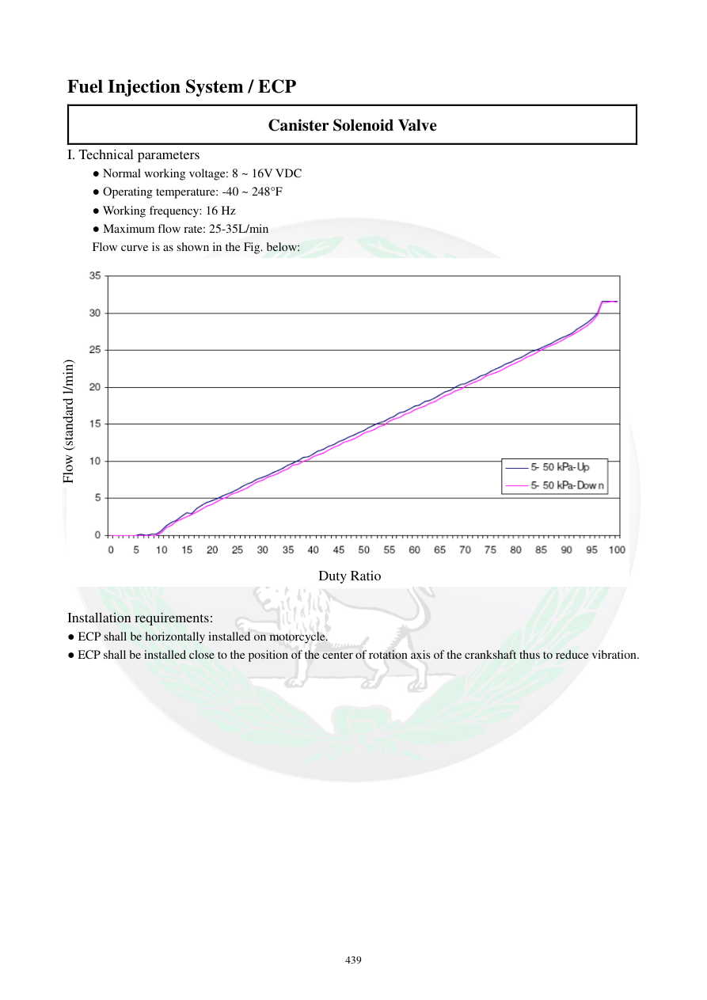
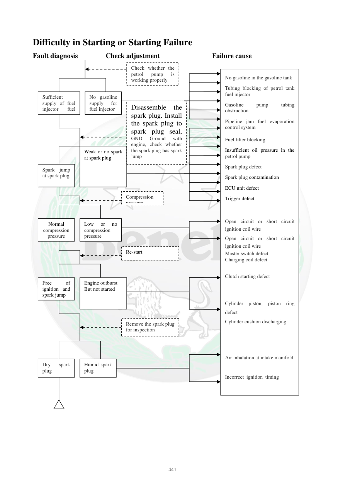
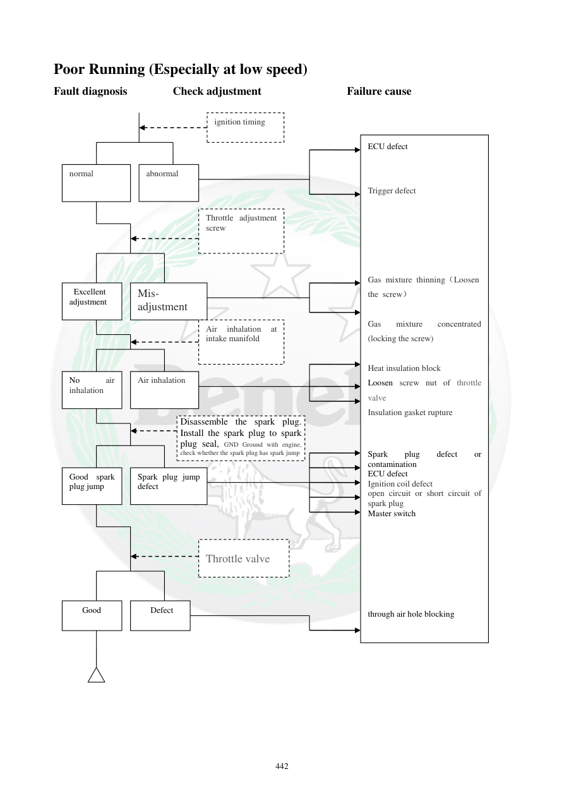
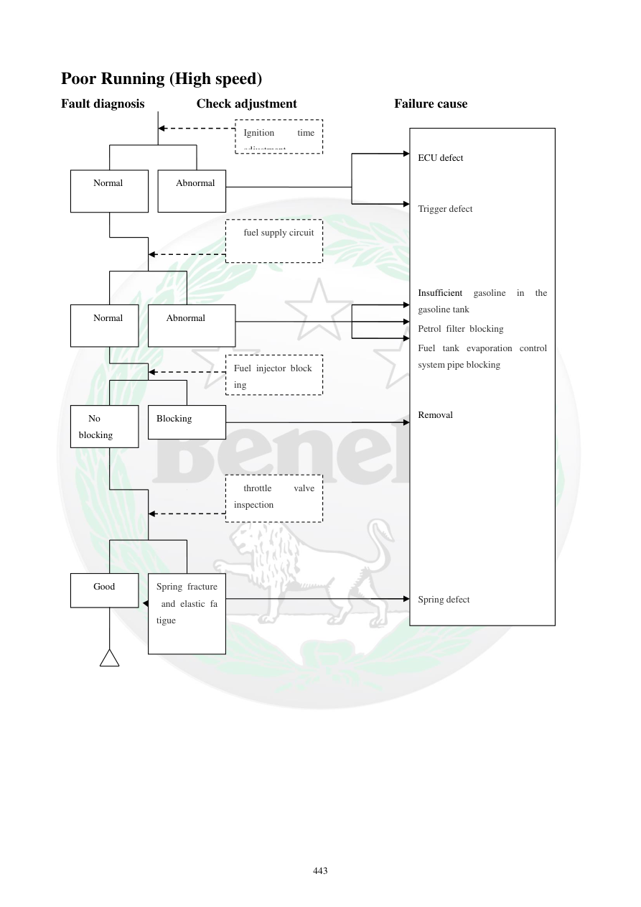
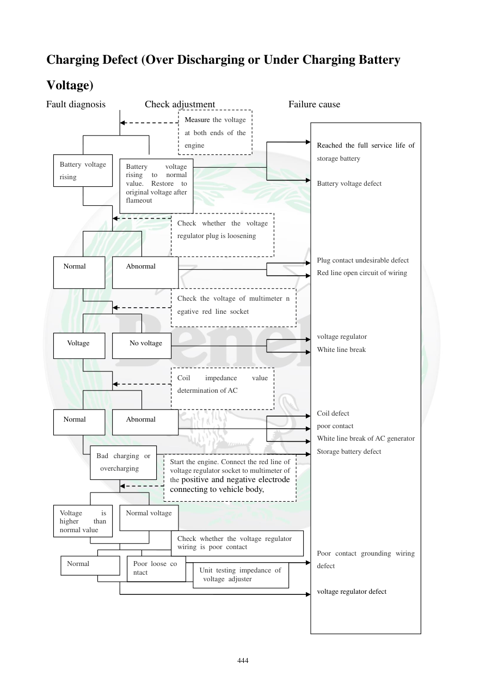
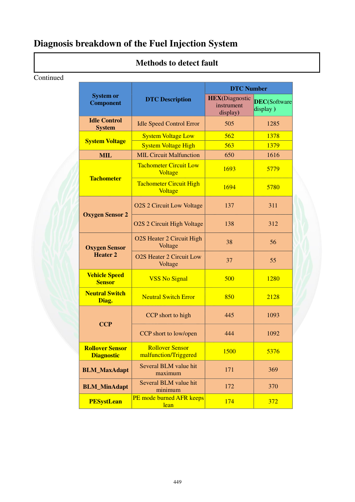
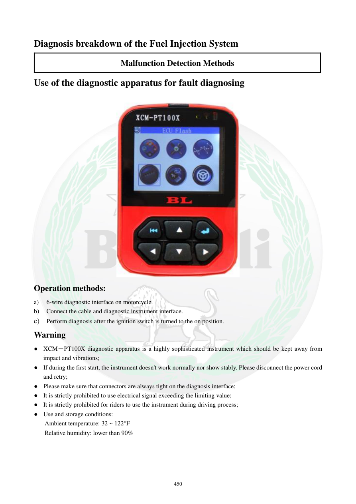

# Knowledge Base: عیب‌یابی و Troubleshooting

> مرجع اصلی: Benelli TNT300 Service Manual، فصل IX، صفحات 440 تا 452  
> دامنه این فایل: مسیرهای عیب‌یابی اولیه، سیستم شارژ، جرقه، FI، کدهای خطا، دیاگ XCM-PT100X و PCHUD.  
> **هشدار مدل:** اعداد و روش‌های این فصل مربوط به مستند TNT300 هستند و نباید بدون تطبیق با مستندات TNT249 به TNT249 تعمیم داده شوند.

---

## 1. صفحه 440: ECP / Canister Solenoid Valve

صفحه 440 در فایل استخراج‌شده پروژه مربوط به شیر برقی کنیستر (ECP) است.

- ولتاژ کاری: **8–16 VDC**
- دمای کاری: **-40 تا 248°F**، حدود **-40 تا 120°C**
- فرکانس کاری: **16 Hz**
- حداکثر دبی: **25–35 L/min**
- نصب ECP باید **افقی** باشد.
- محل نصب باید نزدیک محور مرکز دوران میل‌لنگ باشد تا لرزش کاهش یابد.
- نمودار Duty Ratio/Flow در تصویر صفحه قرار دارد و برای خواندن مقدار دقیق باید به تصویر اصلی مراجعه شود.

[صفحه 440](../manual-pages/page-0440.md)  

---

## 2. صفحه 441: نقشه فصل عیب‌یابی

صفحه 441 فهرست مسیرهای اصلی عیب‌یابی را نشان می‌دهد:

- سخت روشن شدن یا روشن نشدن: صفحه 442
- بد کار کردن در دور پایین: صفحه 443
- بد کار کردن در دور بالا: صفحه 444
- کم‌شارژی/بیش‌شارژی: صفحه 445
- عیب‌یابی شمع و جرقه: صفحه 446
- عیب‌یابی سیستم تزریق سوخت: صفحات 447 به بعد
- تشخیص با چراغ FI
- تشخیص با دستگاه دیاگ
- تشخیص با PCHUD

[صفحه 441](../manual-pages/page-0441.md)  

---

## 3. سخت روشن شدن یا روشن نشدن موتور

### صفحه مرجع 442

فلوچارت عیب‌یابی سه محور اصلی دارد:

### A) سوخت
بررسی شود:
1. وجود بنزین در باک
2. عملکرد صحیح پمپ بنزین
3. گرفتگی شیلنگ/مسیر سوخت
4. گرفتگی فیلتر سوخت
5. گرفتگی مسیر سیستم کنترل بخارات سوخت
6. کافی بودن فشار پمپ بنزین
7. وجود سوخت کافی در مسیر انژکتور

### B) جرقه
اگر سوخت‌رسانی مناسب است:
1. شمع را خارج و از نظر وجود جرقه بررسی کنید.
2. شمع معیوب یا آلوده را بررسی/تعویض کنید.
3. سیم و سوکت کویل را بررسی کنید.
4. ECU و Trigger طبق مسیر فلوچارت بررسی شوند.
5. سوئیچ اصلی و مدارهای مرتبط بررسی شوند.

### C) کمپرس
اگر سوخت و جرقه مناسب هستند:
- کمپرس موتور بررسی شود.
- کمپرس کم یا صفر می‌تواند با مواردی مانند **پیستون، رینگ پیستون، واشر سرسیلندر** یا نشتی هوای ورودی مرتبط باشد.
- زمان‌بندی جرقه نیز در مسیر عیب‌یابی بررسی می‌شود.

### نکته عملی
این فلوچارت برای «استارت می‌خورد ولی روشن نمی‌شود» است. اگر موتور اصلاً نمی‌چرخد، این صفحه مسیر اصلی نیست و باید سیستم Starting بررسی شود.

[صفحه 442](../manual-pages/page-0442.md)  

---

## 4. بد کار کردن موتور در دور پایین

### صفحه مرجع 443

موارد اصلی:

### جرقه و احتراق
- زمان‌بندی جرقه
- کیفیت جرقه شمع
- خرابی یا آلودگی شمع
- کویل احتراق
- سیم‌کشی و سوکت شمع/کویل
- ECU
- Trigger
- Master Switch

### هوای ورودی و دریچه گاز
- ورود هوای اضافی از منیفولد
- وضعیت دریچه گاز
- گرفتگی مسیر/سوراخ هوای عبوری
- وضعیت تنظیم پیچ دریچه گاز
- عایق و واشر مسیر ورودی

### مخلوط سوخت و هوا
فلوچارت منبع اشاره می‌کند:
- شل کردن پیچ تنظیم → مخلوط رقیق‌تر
- سفت کردن پیچ تنظیم → مخلوط غنی‌تر

**مقدار تنظیم از روی این صفحه مشخص نیست و نباید حدس زده شود.**

[صفحه 443](../manual-pages/page-0443.md)  

---

## 5. بد کار کردن موتور در دور بالا

### صفحه مرجع 444

موارد بررسی:

- زمان‌بندی جرقه
- ECU
- Trigger
- مدار تأمین سوخت
- کمبود بنزین در باک
- گرفتگی فیلتر سوخت
- گرفتگی مسیر سیستم کنترل بخارات سوخت
- گرفتگی انژکتور
- بررسی دریچه گاز
- خرابی، شکستگی یا خستگی فنر مکانیزم دریچه گاز

بخش‌هایی از OCR این صفحه به‌هم‌ریخته است؛ **تصویر صفحه مرجع نهایی فلوچارت است.**

[صفحه 444](../manual-pages/page-0444.md)  

---

## 6. عیب‌یابی سیستم شارژ

### صفحه مرجع 445

برای کم‌شارژی یا بیش‌شارژی، مسیر بررسی شامل موارد زیر است:

1. اندازه‌گیری ولتاژ باتری.
2. بررسی رسیدن ولتاژ باتری به مقدار طبیعی.
3. بررسی سوکت رگولاتور از نظر شل بودن.
4. بررسی کیفیت تماس سوکت‌ها.
5. بررسی سیم‌های مدار رگولاتور.
6. بررسی سیم‌پیچ/ژنراتور AC و مقاومت آن طبق مشخصات سرویس.
7. بررسی اتصال بدنه.
8. بررسی خود باتری.
9. بررسی رگولاتور ولتاژ.

**مقادیر دقیق مقاومت و ولتاژ آزمون باید از صفحات مشخصات سیستم شارژ در Knowledge Base گرفته شوند، نه از OCR ناقص این فلوچارت.**

[صفحه 445](../manual-pages/page-0445.md)  

---

## 7. عیب‌یابی شمع و سیستم جرقه

### صفحه مرجع 446

اگر جرقه شمع ضعیف یا وجود نداشته باشد:

1. شمع را بررسی و در صورت نیاز با نمونه سالم جایگزین کنید.
2. محکم بودن کلاهک شمع را بررسی کنید.
3. سوکت کویل احتراق را بررسی کنید.
4. رسانایی بین ترمینال‌ها و مقاومت کویل را طبق مشخصات سرویس بررسی کنید.
5. سیم‌کشی و قطعات مرتبط را بررسی کنید.
6. سوکت کویل از نظر تماس بد یا شل بودن بررسی شود.
7. سیم‌کشی اصلی و کانکتورها بررسی شوند.
8. در صورت نیاز ECU با ابزار تشخیصی بررسی شود.

علت‌های ذکرشده در فلوچارت:
- خرابی شمع
- شل بودن کلاهک شمع
- تماس بد سوکت
- خرابی سیم‌پیچ شارژ
- مشکل Trigger
- خرابی کویل احتراق
- قطع بودن سیم اصلی
- تماس بد سوکت
- خرابی کابل
- خرابی ECU

[صفحه 446](../manual-pages/page-0446.md)  

---

# 8. چراغ FI و تشخیص سیستم تزریق سوخت

## 8.1 رفتار عادی چراغ FI

### صفحه مرجع 447

طبق منبع:
- با باز کردن سوئیچ، چراغ FI روشن می‌شود.
- این حالت نشان‌دهنده برق‌دار بودن سیستم تزریق است.
- پس از روشن شدن موتور، چراغ FI باید خاموش شود.
- اگر چراغ FI خاموش نشود، سیستم نیاز به عیب‌یابی دارد.
- در ابتدا فیوزها و اتصالات مثبت و منفی باتری بررسی شوند.

[صفحه 447](../manual-pages/page-0447.md)  

---

## 8.2 خواندن کد خطا با چشمک چراغ FI

### صفحه مرجع 448

روش منبع:
**ON → OFF → ON → OFF → ON**

سپس چراغ FI کد خطا را با چشمک نمایش می‌دهد.

قاعده نمایش:
- عدد **0 = ده چشمک**
- اعداد 1 تا 9 = همان تعداد چشمک
- فاصله بین ارقام: حدود **1.2 ثانیه**
- فاصله بین کدهای متوالی: حدود **3.2 ثانیه**

مثال منبع:
**P0107**
- 10 چشمک = 0
- 1 چشمک = 1
- 10 چشمک = 0
- 7 چشمک = 7

در PCHUD ممکن است همین خطا به شکل عدد اعشاری نمایش داده شود. مثال منبع:
- **MULFCURR = 263**
- متناظر با **P0107**
- مربوط به خطای MAP

[صفحه 448](../manual-pages/page-0448.md)  

---

# 9. جدول کدهای خطای MT05

## 9.1 بخش اول، صفحه 449

| سیستم/قطعه | شرح خطا | HEX | DEC |
|---|---|---:|---:|
| MAP | ولتاژ پایین یا مدار باز | 107 | 263 |
| MAP | ولتاژ بالا | 108 | 264 |
| IAT | ولتاژ پایین | 112 | 274 |
| IAT | ولتاژ بالا یا مدار باز | 113 | 275 |
| Coolant Temp Sensor | ولتاژ پایین | 117 | 279 |
| Coolant Temp Sensor | ولتاژ بالا یا مدار باز | 118 | 280 |
| TPS | ولتاژ پایین یا مدار باز | 122 | 290 |
| TPS | ولتاژ بالا | 123 | 291 |
| O2S 1 | ولتاژ پایین | 131 | 305 |
| O2S 1 | ولتاژ بالا | 132 | 306 |
| O2 Heater | ولتاژ بالا | 31 | 49 |
| O2 Heater | ولتاژ پایین | 32 | 50 |
| Injector A | خطای انژکتور | 201 | 513 |
| Injector B | خطای انژکتور | 202 | 514 |
| Fuel Pump Relay | ولتاژ پایین یا مدار باز | 230 | 560 |
| Fuel Pump Relay | ولتاژ بالا | 232 | 562 |
| CKP | سیگنال نویزی | 336 | 822 |
| CKP | بدون سیگنال | 337 | 823 |
| Ignition Coil A | خطای کویل سیلندر A | 351 | 849 |
| Ignition Coil B | خطای کویل سیلندر B | 352 | 850 |

[صفحه 449](../manual-pages/page-0449.md)  

## 9.2 بخش دوم، صفحه 450

| سیستم/قطعه | شرح خطا | HEX | DEC |
|---|---|---:|---:|
| Idle Control | خطای کنترل دور آرام | 505 | 1285 |
| System Voltage | ولتاژ پایین | 562 | 1378 |
| System Voltage | ولتاژ بالا | 563 | 1379 |
| MIL | خطای مدار MIL | 650 | 1616 |
| Tachometer | ولتاژ پایین مدار | 1693 | 5779 |
| Tachometer | ولتاژ بالای مدار | 1694 | 5780 |
| O2S 2 | ولتاژ پایین | 137 | 311 |
| O2S 2 | ولتاژ بالا | 138 | 312 |
| O2 Heater 2 | ولتاژ بالا | 38 | 56 |
| O2 Heater 2 | ولتاژ پایین | 37 | 55 |
| VSS | بدون سیگنال | 500 | 1280 |
| Neutral Switch | خطای کلید خلاص | 850 | 2128 |
| CCP | اتصال کوتاه به مثبت | 445 | 1093 |
| CCP | اتصال کوتاه به منفی/مدار باز | 444 | 1092 |
| Rollover Sensor | خرابی/فعال شدن | 1500 | 5376 |
| BLM_MaxAdapt | چند مقدار BLM به حداکثر رسیده | 171 | 369 |
| BLM_MinAdapt | چند مقدار BLM به حداقل رسیده | 172 | 370 |
| PESystLean | AFR در حالت PE همچنان رقیق است | 174 | 372 |

[صفحه 450](../manual-pages/page-0450.md)  

> **قاعده مهم:** HEX و DEC در جدول منبع را با هم جابه‌جا نکنید. این دو ستون مربوط به روش نمایش در دستگاه دیاگ و نرم‌افزار هستند.

---

# 10. دستگاه دیاگ XCM-PT100X

### صفحه مرجع 451

روش اتصال:
1. رابط 6 سیمه دیاگ روی موتورسیکلت را پیدا کنید.
2. کابل را به رابط موتورسیکلت و دستگاه دیاگ متصل کنید.
3. سوئیچ را روی ON قرار دهید.
4. تشخیص را انجام دهید.

هشدارهای منبع:
- دستگاه XCM-PT100X حساس است و باید از ضربه و لرزش محافظت شود.
- اگر در راه‌اندازی اولیه پایدار نبود، برق را جدا و دوباره وصل کنید.
- کانکتورهای دیاگ باید محکم باشند.
- اعمال سیگنال الکتریکی بیشتر از محدوده مجاز ممنوع است.
- استفاده از دستگاه هنگام حرکت ممنوع است.
- دمای کاری/نگهداری اعلام‌شده: **32 تا 122°F**، حدود **0 تا 50°C**
- رطوبت نسبی: کمتر از **90%**

[صفحه 451](../manual-pages/page-0451.md)  

---

# 11. نرم‌افزار PCHUD

### صفحه مرجع 452

PCHUD برای خواندن و ثبت داده‌های عملکرد موتور استفاده می‌شود.

### اتصال
- لپ‌تاپ → کابل K-wire → کانکتور دیاگ 6 پین موتورسیکلت
- محل کانکتور: زیر زین عقب

### راه‌اندازی طبق منبع
1. K-wire را متصل کنید و سوئیچ را ON کنید.
2. فایل **HUD.EXE** را اجرا کنید.
3. از File، فایل **PCHUD.HAD** را باز کنید.
4. در Setup → Parameter File، فایل **MT05common.par** را انتخاب کنید.
5. در Setup → Comm protocol، گزینه **Keyword2000** را انتخاب کنید.
6. Device Code را روی **17** قرار دهید.

منبع محدودیت‌های نرم‌افزار قدیمی را نیز ذکر می‌کند؛ این محدودیت‌ها را نباید به‌عنوان الزام نرم‌افزارهای امروزی تلقی کرد.

[صفحه 452](../manual-pages/page-0452.md)  

---

# 12. مسیر سریع عیب‌یابی

برای استفاده عملی از این Knowledge Base:

### موتور روشن نمی‌شود
**سوخت → جرقه → کمپرس → ECU/سنسورها**

### موتور در دور پایین بد کار می‌کند
**جرقه → هوای ورودی → دریچه گاز → مخلوط → ECU/Trigger**

### موتور در دور بالا بد کار می‌کند
**زمان‌بندی جرقه → سوخت‌رسانی → فیلتر/انژکتور → دریچه گاز**

### باتری شارژ نمی‌شود یا بیش‌شارژ است
**باتری → سوکت‌ها → سیم‌کشی → سیم‌پیچ AC → رگولاتور → اتصال بدنه**

### چراغ FI روشن می‌ماند
**فیوز و باتری → خواندن کد FI → جدول DTC → تست قطعه/سیم‌کشی**

---

# 13. قواعد استفاده از این فصل

1. فلوچارت‌ها باید همراه **تصویر صفحه اصلی** تفسیر شوند؛ OCR بعضی صفحات ناقص است.
2. عدد یا مقدار نامشخص از OCR نباید حدس زده شود.
3. برای مقادیر دقیق مقاومت، ولتاژ، فشار و گشتاور باید به صفحه مشخصات همان قطعه در Knowledge Base ارجاع داده شود.
4. کدهای DTC در جدول به همان شکل منبع ثبت شده‌اند.
5. اطلاعات این فایل از **TNT300 Service Manual** است و برای **TNT249** باید جداگانه تطبیق داده شود.
6. تجربه تعمیر واقعی کاربر باید جدا از داده رسمی Manual ثبت شود و نباید به‌عنوان مشخصه کارخانه‌ای وارد شود.

---

## منابع مستقیم پروژه

- [فصل IX، صفحه 440](../manual-pages/page-0440.md)
- [فصل IX، صفحه 441](../manual-pages/page-0441.md)
- [فصل IX، صفحه 442](../manual-pages/page-0442.md)
- [فصل IX، صفحه 443](../manual-pages/page-0443.md)
- [فصل IX، صفحه 444](../manual-pages/page-0444.md)
- [فصل IX، صفحه 445](../manual-pages/page-0445.md)
- [فصل IX، صفحه 446](../manual-pages/page-0446.md)
- [فصل IX، صفحه 447](../manual-pages/page-0447.md)
- [فصل IX، صفحه 448](../manual-pages/page-0448.md)
- [فصل IX، صفحه 449](../manual-pages/page-0449.md)
- [فصل IX، صفحه 450](../manual-pages/page-0450.md)
- [فصل IX، صفحه 451](../manual-pages/page-0451.md)
- [فصل IX، صفحه 452](../manual-pages/page-0452.md)
