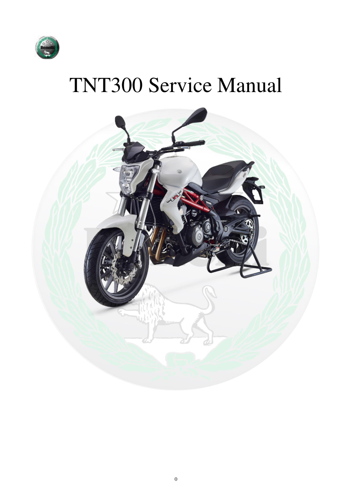

# Manual page 1

> Source: [page-0001.md](../source/page-0001.md)

## Page image / diagram

- [page-0001-img-01.jpeg](../images/embedded/page-0001-img-01.jpeg)

- [page-0001-img-02.jpeg](../images/embedded/page-0001-img-02.jpeg)

- [page-0001-img-03.jpeg](../images/embedded/page-0001-img-03.jpeg)

## Extracted text

# Source page 1

 
0 
 
TNT300 Service Manual

## Persian notes

### ترجمه و توضیح فارسی
این صفحه جلد **دفترچه تعمیرات و سرویس Benelli TNT300** است. این فایل مرجع اصلی دستورالعمل‌های تعمیر، سرویس، تنظیم و عیب‌یابی مدل TNT300 است.

> **توجه مدل:** اعداد و مشخصات این دفترچه برای TNT300 هستند و نباید بدون تطبیق با مشخصات TNT249 به آن تعمیم داده شوند.
