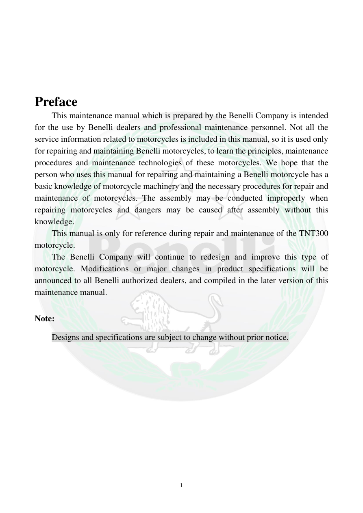

# Manual page 2

> Source: [page-0002.md](../source/page-0002.md)

## Page image / diagram

## Extracted text

# Source page 2

 
1 
 
 
 
 
Preface 
This maintenance manual which is prepared by the Benelli Company is intended 
for the use by Benelli dealers and professional maintenance personnel. Not all the 
service information related to motorcycles is included in this manual, so it is used only 
for repairing and maintaining Benelli motorcycles, to learn the principles, maintenance 
procedures and maintenance technologies of these motorcycles. We hope that the 
person who uses this manual for repairing and maintaining a Benelli motorcycle has a 
basic knowledge of motorcycle machinery and the necessary procedures for repair and 
maintenance of motorcycles. The assembly may be conducted improperly when 
repairing motorcycles and dangers may be caused after assembly without this 
knowledge. 
This manual is only for reference during repair and maintenance of the TNT300 
motorcycle. 
The Benelli Company will continue to redesign and improve this type of 
motorcycle. Modifications or major changes in product specifications will be 
announced to all Benelli authorized dealers, and compiled in the later version of this 
maintenance manual. 
 
Note: 
Designs and specifications are subject to change without prior notice.

## Persian notes

<!-- Persian translation/explanation will be added here. -->
