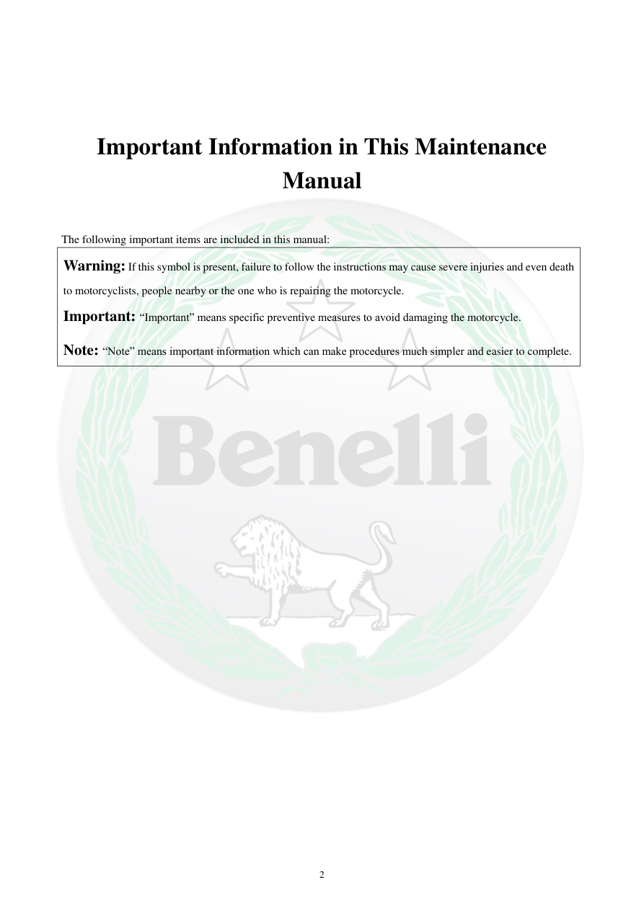

# Manual page 3

> Source: [page-0003.md](../source/page-0003.md)

## Page image / diagram

## Extracted text

# Source page 3

 
2 
 
 
Important Information in This Maintenance 
Manual 
 
The following important items are included in this manual: 
Warning: If this symbol is present, failure to follow the instructions may cause severe injuries and even death 
to motorcyclists, people nearby or the one who is repairing the motorcycle.   
Important: “Important” means specific preventive measures to avoid damaging the motorcycle. 
Note: “Note” means important information which can make procedures much simpler and easier to complete.

## Persian notes

### ترجمه و توضیح فارسی
علائم مهم دفترچه:
- **هشدار (Warning):** رعایت نکردن دستورالعمل می‌تواند باعث آسیب شدید یا حتی مرگ شود.
- **مهم (Important):** اقدام پیشگیرانه‌ای برای جلوگیری از آسیب به موتورسیکلت.
- **نکته (Note):** اطلاعاتی که انجام کار را ساده‌تر و سریع‌تر می‌کند.

در تعمیرات، این سه سطح را از هم جدا نگه دارید؛ مخصوصاً هشدارهای ایمنی.
