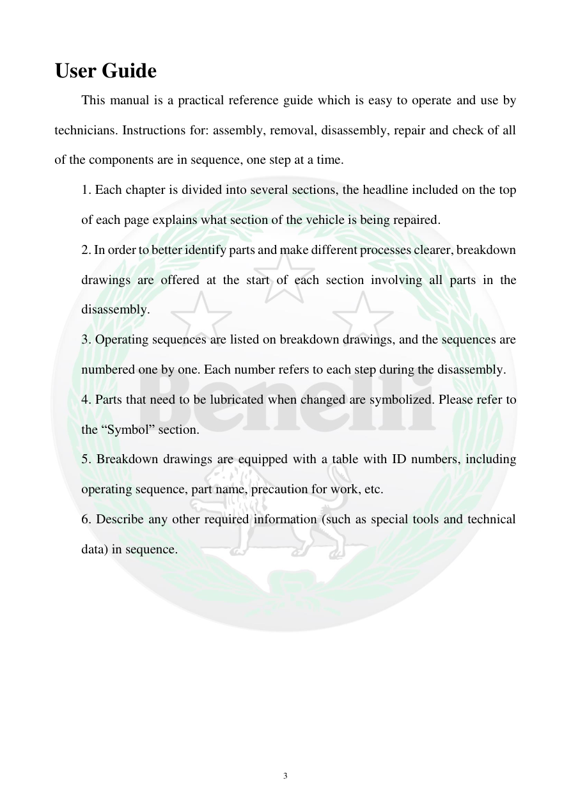

# Manual page 4

> Source: [page-0004.md](../source/page-0004.md)

## Page image / diagram

## Extracted text

# Source page 4

 
3 
User Guide 
This manual is a practical reference guide which is easy to operate and use by 
technicians. Instructions for: assembly, removal, disassembly, repair and check of all 
of the components are in sequence, one step at a time. 
1. Each chapter is divided into several sections, the headline included on the top 
of each page explains what section of the vehicle is being repaired. 
2. In order to better identify parts and make different processes clearer, breakdown 
drawings are offered at the start of each section involving all parts in the 
disassembly. 
3. Operating sequences are listed on breakdown drawings, and the sequences are 
numbered one by one. Each number refers to each step during the disassembly. 
4. Parts that need to be lubricated when changed are symbolized. Please refer to 
the “Symbol” section. 
5. Breakdown drawings are equipped with a table with ID numbers, including 
operating sequence, part name, precaution for work, etc. 
6. Describe any other required information (such as special tools and technical 
data) in sequence.

## Persian notes

### ترجمه و توضیح فارسی
راهنمای استفاده از دفترچه: دستورهای باز کردن، جداسازی، تعمیر، کنترل و مونتاژ قطعات به صورت مرحله‌ای ارائه شده‌اند. عنوان بالای هر صفحه بخش مورد تعمیر را مشخص می‌کند. نقشه‌های انفجاری ابتدای هر بخش قطعات و ترتیب باز کردن را نشان می‌دهند و شماره‌های روی نقشه به مراحل کار مربوط‌اند. نمادهای مخصوص برای نقاط روغن‌کاری و اطلاعاتی مثل ابزار ویژه و داده‌های فنی نیز استفاده شده‌اند.
