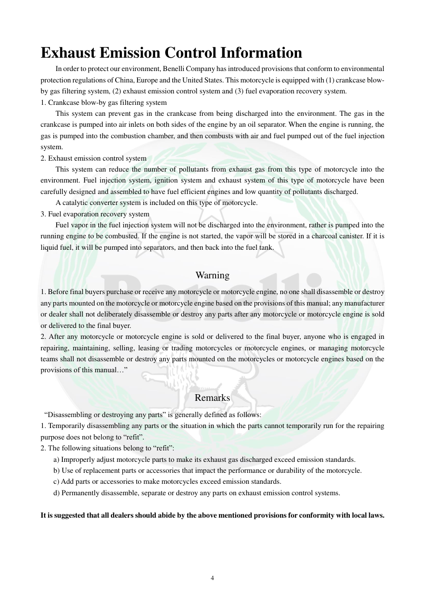

# Manual page 5

> Source: [page-0005.md](../source/page-0005.md)

## Page image / diagram

## Extracted text

# Source page 5

 
4 
Exhaust Emission Control Information 
In order to protect our environment, Benelli Company has introduced provisions that conform to environmental 
protection regulations of China, Europe and the United States. This motorcycle is equipped with (1) crankcase blow-
by gas filtering system, (2) exhaust emission control system and (3) fuel evaporation recovery system. 
1. Crankcase blow-by gas filtering system 
This system can prevent gas in the crankcase from being discharged into the environment. The gas in the 
crankcase is pumped into air inlets on both sides of the engine by an oil separator. When the engine is running, the 
gas is pumped into the combustion chamber, and then combusts with air and fuel pumped out of the fuel injection 
system.  
2. Exhaust emission control system 
This system can reduce the number of pollutants from exhaust gas from this type of motorcycle into the 
environment. Fuel injection system, ignition system and exhaust system of this type of motorcycle have been 
carefully designed and assembled to have fuel efficient engines and low quantity of pollutants discharged. 
A catalytic converter system is included on this type of motorcycle.  
3. Fuel evaporation recovery system 
Fuel vapor in the fuel injection system will not be discharged into the environment, rather is pumped into the 
running engine to be combusted. If the engine is not started, the vapor will be stored in a charcoal canister. If it is 
liquid fuel, it will be pumped into separators, and then back into the fuel tank. 
 
Warning 
1. Before final buyers purchase or receive any motorcycle or motorcycle engine, no one shall disassemble or destroy 
any parts mounted on the motorcycle or motorcycle engine based on the provisions of this manual; any manufacturer 
or dealer shall not deliberately disassemble or destroy any parts after any motorcycle or motorcycle engine is sold 
or delivered to the final buyer. 
2. After any motorcycle or motorcycle engine is sold or delivered to the final buyer, anyone who is engaged in 
repairing, maintaining, selling, leasing or trading motorcycles or motorcycle engines, or managing motorcycle 
teams shall not disassemble or destroy any parts mounted on the motorcycles or motorcycle engines based on the 
provisions of this manual…” 
 
Remarks 
 “Disassembling or destroying any parts” is generally defined as follows: 
1. Temporarily disassembling any parts or the situation in which the parts cannot temporarily run for the repairing 
purpose does not belong to “refit”. 
2. The following situations belong to “refit”: 
a) Improperly adjust motorcycle parts to make its exhaust gas discharged exceed emission standards. 
b) Use of replacement parts or accessories that impact the performance or durability of the motorcycle. 
c) Add parts or accessories to make motorcycles exceed emission standards. 
d) Permanently disassemble, separate or destroy any parts on exhaust emission control systems. 
 
It is suggested that all dealers should abide by the above mentioned provisions for conformity with local laws.

## Persian notes

<!-- Persian translation/explanation will be added here. -->
