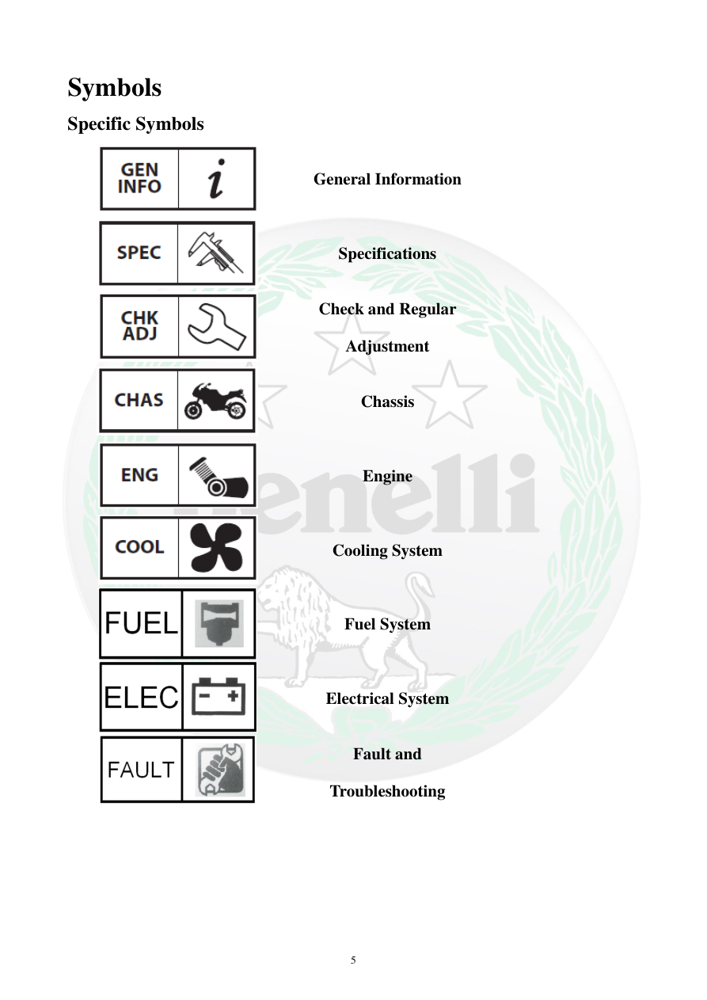

# Manual page 6

> Source: [page-0006.md](../source/page-0006.md)

## Page image / diagram

- [page-0006-img-01.jpeg](../images/embedded/page-0006-img-01.jpeg)

- [page-0006-img-02.png](../images/embedded/page-0006-img-02.png)

- [page-0006-img-03.jpeg](../images/embedded/page-0006-img-03.jpeg)

- [page-0006-img-05.png](../images/embedded/page-0006-img-05.png)

- [page-0006-img-06.png](../images/embedded/page-0006-img-06.png)

- [page-0006-img-07.png](../images/embedded/page-0006-img-07.png)

- [page-0006-img-08.png](../images/embedded/page-0006-img-08.png)

- [page-0006-img-09.png](../images/embedded/page-0006-img-09.png)

- [page-0006-img-10.png](../images/embedded/page-0006-img-10.png)

## Extracted text

# Source page 6

 
5 
Symbols 
Specific Symbols 
 
General Information 
 
 
Specifications 
 
 
Check and Regular 
Adjustment 
 
 
Chassis 
 
 
Engine 
 
 
Cooling System 
 
 
Fuel System 
 
 
Electrical System 
 
 
Fault and 
Troubleshooting

## Persian notes

### ترجمه و توضیح فارسی
این صفحه فهرست **نمادهای بخش‌های دفترچه** را معرفی می‌کند: اطلاعات عمومی، مشخصات، کنترل و تنظیم دوره‌ای، شاسی، موتور، سیستم خنک‌کاری، سیستم سوخت، سیستم برق و عیب‌یابی.

این نمادها برای پیدا کردن سریع نوع اطلاعات هر بخش استفاده می‌شوند.
