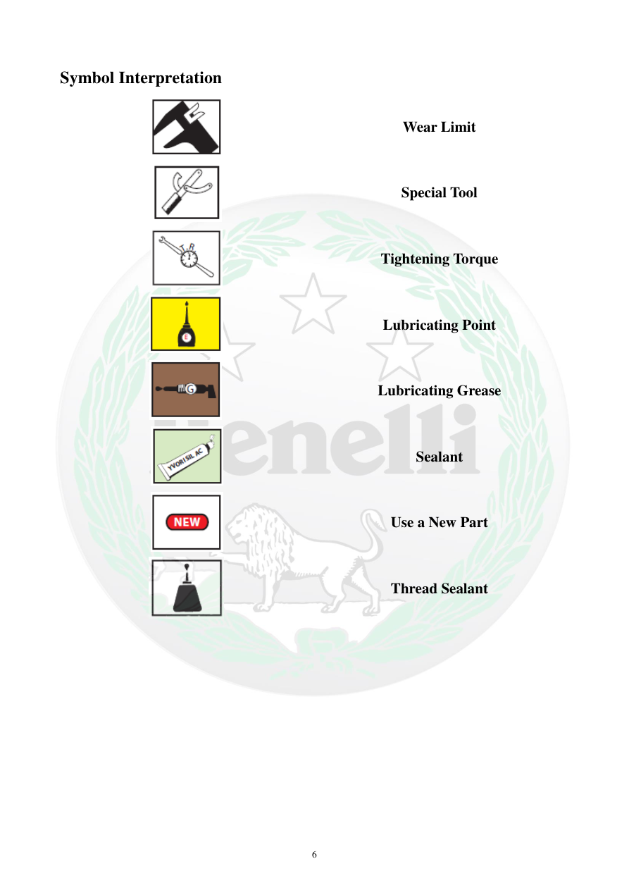

# Manual page 7

> Source: [page-0007.md](../source/page-0007.md)

## Page image / diagram

- [page-0007-img-02.png](../images/embedded/page-0007-img-02.png)

- [page-0007-img-03.png](../images/embedded/page-0007-img-03.png)

- [page-0007-img-04.png](../images/embedded/page-0007-img-04.png)

- [page-0007-img-05.png](../images/embedded/page-0007-img-05.png)

- [page-0007-img-06.png](../images/embedded/page-0007-img-06.png)

- [page-0007-img-07.png](../images/embedded/page-0007-img-07.png)

- [page-0007-img-08.png](../images/embedded/page-0007-img-08.png)

- [page-0007-img-09.png](../images/embedded/page-0007-img-09.png)

## Extracted text

# Source page 7

 
6 
Symbol Interpretation 
 
Wear Limit 
 
Special Tool 
 
Tightening Torque 
 
Lubricating Point 
 
Lubricating Grease 
 
Sealant 
 
Use a New Part 
 
Thread Sealant

## Persian notes

### ترجمه و توضیح فارسی
تفسیر نمادهای فنی:
- **Wear Limit:** حد فرسودگی/حد مجاز استفاده
- **Special Tool:** ابزار مخصوص
- **Tightening Torque:** گشتاور سفت‌کردن
- **Lubricating Point:** محل روغن‌کاری
- **Lubricating Grease:** گریس‌کاری
- **Sealant:** درزگیر
- **Use a New Part:** استفاده از قطعه نو
- **Thread Sealant:** چسب رزوه

در تعمیرات، این نمادها تعیین می‌کنند چه ماده یا ابزار و چه محدودیتی باید رعایت شود.
