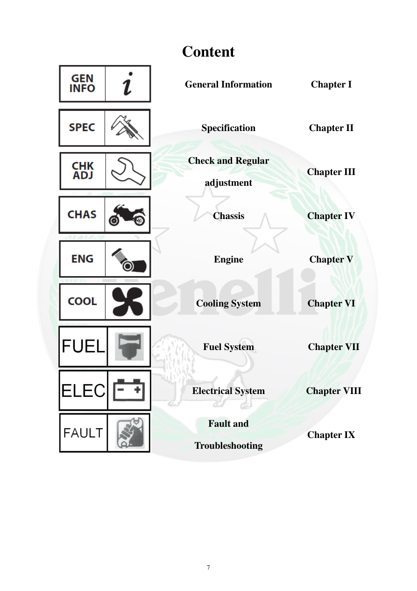

# Manual page 8

> Source: [page-0008.md](../source/page-0008.md)

## Page image / diagram

## Extracted text

# Source page 8

 
7 
Content 
 
General Information 
Chapter I 
 
Specification 
Chapter II 
 
Check and Regular 
adjustment 
Chapter III 
 
Chassis 
Chapter IV 
 
Engine 
Chapter V 
 
Cooling System 
Chapter VI 
 
Fuel System 
 Chapter VII 
 
Electrical System 
 Chapter VIII 
 
Fault and 
Troubleshooting 
Chapter IX

## Persian notes

<!-- Persian translation/explanation will be added here. -->
