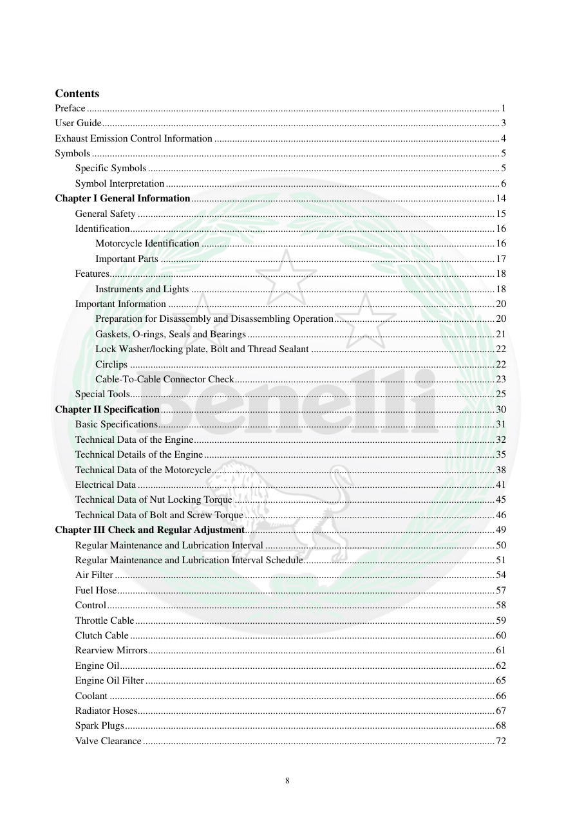

# Manual page 9

> Source: [page-0009.md](../source/page-0009.md)

## Page image / diagram

## Extracted text

# Source page 9

 
8 
 
Contents  
Preface .................................................................................................................................................................. 1 
User Guide ............................................................................................................................................................ 3 
Exhaust Emission Control Information ................................................................................................................ 4 
Symbols ................................................................................................................................................................ 5 
Specific Symbols .......................................................................................................................................... 5 
Symbol Interpretation ................................................................................................................................... 6 
Chapter I General Information ....................................................................................................................... 14 
General Safety ............................................................................................................................................ 15 
Identification ............................................................................................................................................... 16 
Motorcycle Identification ................................................................................................................... 16 
Important Parts ................................................................................................................................... 17 
Features ....................................................................................................................................................... 18 
Instruments and Lights ....................................................................................................................... 18 
Important Information ................................................................................................................................ 20 
Preparation for Disassembly and Disassembling Operation ............................................................... 20 
Gaskets, O-rings, Seals and Bearings ................................................................................................. 21 
Lock Washer/locking plate, Bolt and Thread Sealant ........................................................................ 22 
Circlips ............................................................................................................................................... 22 
Cable-To-Cable Connector Check ...................................................................................................... 23 
Special Tools ............................................................................................................................................... 25 
Chapter II Specification ................................................................................................................................... 30 
Basic Specifications .................................................................................................................................... 31 
Technical Data of the Engine ...................................................................................................................... 32 
Technical Details of the Engine .................................................................................................................. 35 
Technical Data of the Motorcycle ............................................................................................................... 38 
Electrical Data ............................................................................................................................................ 41 
Technical Data of Nut Locking Torque ...................................................................................................... 45 
Technical Data of Bolt and Screw Torque .................................................................................................. 46 
Chapter III Check and Regular Adjustment.................................................................................................. 49 
Regular Maintenance and Lubrication Interval .......................................................................................... 50 
Regular Maintenance and Lubrication Interval Schedule ........................................................................... 51 
Air Filter ..................................................................................................................................................... 54 
Fuel Hose .................................................................................................................................................... 57 
Control ........................................................................................................................................................ 58 
Throttle Cable ............................................................................................................................................. 59 
Clutch Cable ............................................................................................................................................... 60 
Rearview Mirrors ........................................................................................................................................ 61 
Engine Oil ................................................................................................................................................... 62 
Engine Oil Filter ......................................................................................................................................... 65 
Coolant ....................................................................................................................................................... 66 
Radiator Hoses ............................................................................................................................................ 67 
Spark Plugs ................................................................................................................................................. 68 
Valve Clearance .......................................................................................................................................... 72

## Persian notes

### ترجمه و توضیح فارسی
فهرست مطالب دفترچه و محل شروع فصل‌ها در این صفحه آمده است. **فصل اول اطلاعات عمومی از صفحه ۱۴** شروع می‌شود و بخش‌های ایمنی، شناسایی، قطعات مهم، تجهیزات، اطلاعات عمومی تعمیر و ابزارهای مخصوص را پوشش می‌دهد. **فصل دوم مشخصات از صفحه ۳۰** و **فصل سوم سرویس و تنظیم دوره‌ای از صفحه ۴۹** آغاز می‌شوند.

این صفحه برای پیدا کردن سریع موضوع و شماره صفحه مرجع است.
