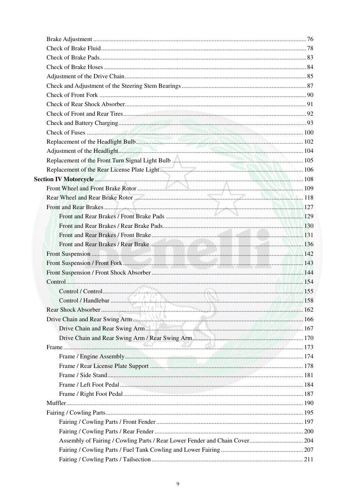

# Manual page 10

> Source: [page-0010.md](../source/page-0010.md)

## Page image / diagram

## Extracted text

# Source page 10

 
9 
Brake Adjustment ....................................................................................................................................... 76 
Check of Brake Fluid .................................................................................................................................. 78 
Check of Brake Pads ................................................................................................................................... 83 
Check of Brake Hoses ................................................................................................................................ 84 
Adjustment of the Drive Chain ................................................................................................................... 85 
Check and Adjustment of the Steering Stem Bearings ............................................................................... 87 
Check of Front Fork ................................................................................................................................... 90 
Check of Rear Shock Absorber................................................................................................................... 91 
Check of Front and Rear Tires .................................................................................................................... 92 
Check and Battery Charging ....................................................................................................................... 93 
Check of Fuses ......................................................................................................................................... 100 
Replacement of the Headlight Bulb .......................................................................................................... 102 
Adjustment of the Headlight ..................................................................................................................... 104 
Replacement of the Front Turn Signal Light Bulb ................................................................................... 105 
Replacement of the Rear License Plate Light ........................................................................................... 106 
Section IV Motorcycle .................................................................................................................................... 108 
Front Wheel and Front Brake Rotor ......................................................................................................... 109 
Rear Wheel and Rear Brake Rotor ........................................................................................................... 118 
Front and Rear Brakes .............................................................................................................................. 127 
Front and Rear Brakes / Front Brake Pads ....................................................................................... 129 
Front and Rear Brakes / Rear Brake Pads ......................................................................................... 130 
Front and Rear Brakes / Front Brake ................................................................................................ 131 
Front and Rear Brakes / Rear Brake ................................................................................................. 136 
Front Suspension ...................................................................................................................................... 142 
Front Suspension / Front Fork .................................................................................................................. 143 
Front Suspension / Front Shock Absorber ................................................................................................ 144 
Control ...................................................................................................................................................... 154 
Control / Control ............................................................................................................................... 155 
Control / Handlebar .......................................................................................................................... 158 
Rear Shock Absorber ................................................................................................................................ 162 
Drive Chain and Rear Swing Arm ............................................................................................................ 166 
Drive Chain and Rear Swing Arm .................................................................................................... 167 
Drive Chain and Rear Swing Arm / Rear Swing Arm ...................................................................... 170 
Frame ........................................................................................................................................................ 173 
Frame / Engine Assembly ................................................................................................................. 174 
Frame / Rear License Plate Support ................................................................................................. 178 
Frame / Side Stand ............................................................................................................................ 181 
Frame / Left Foot Pedal .................................................................................................................... 184 
Frame / Right Foot Pedal .................................................................................................................. 187 
Muffler ...................................................................................................................................................... 190 
Fairing / Cowling Parts ............................................................................................................................. 195 
Fairing / Cowling Parts / Front Fender ............................................................................................. 197 
Fairing / Cowling Parts / Rear Fender .............................................................................................. 200 
Assembly of Fairing / Cowling Parts / Rear Lower Fender and Chain Cover .................................. 204 
Fairing / Cowling Parts / Fuel Tank Cowling and Lower Fairing .................................................... 207 
Fairing / Cowling Parts / Tailsection ................................................................................................ 211

## Persian notes

### ترجمه و توضیح فارسی
ادامه فهرست مطالب شامل بخش‌های سرویس دوره‌ای، ترمزها، زنجیر، فرمان، دوشاخه، کمک عقب، تایر و باتری و سپس فصل چهارم شاسی است. در فصل شاسی، چرخ‌ها، ترمزها، تعلیق جلو، فرمان، کمک عقب، زنجیر و بازوی عقب، شاسی، پایه‌ها، اگزوز، فلاپ‌ها و چراغ‌ها پوشش داده می‌شوند.

شماره صفحات این فهرست برای ارجاع مستقیم به بخش تعمیر استفاده می‌شود.
