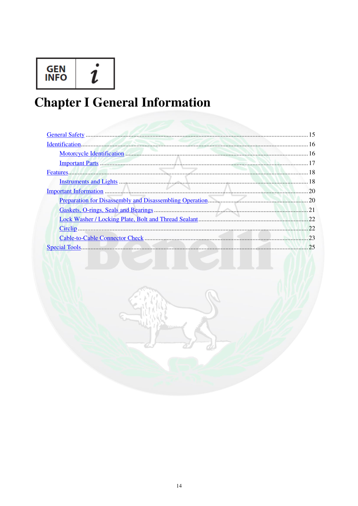

# Manual page 15

> Source: [page-0015.md](../source/page-0015.md)

## Page image / diagram

## Extracted text

# Source page 15

 
14 
 
 
Chapter I General Information 
 
 
General Safety ............................................................................................................................................ 15 
Identification ............................................................................................................................................... 16 
Motorcycle Identification ................................................................................................................... 16 
Important Parts ................................................................................................................................... 17 
Features ....................................................................................................................................................... 18 
Instruments and Lights ....................................................................................................................... 18 
Important Information ................................................................................................................................ 20 
Preparation for Disassembly and Disassembling Operation ............................................................... 20 
Gaskets, O-rings, Seals and Bearings ................................................................................................. 21 
Lock Washer / Locking Plate, Bolt and Thread Sealant ..................................................................... 22 
Circlip ................................................................................................................................................. 22 
Cable-to-Cable Connector Check ....................................................................................................... 23 
Special Tools ............................................................................................................................................... 25

## Persian notes

<!-- Persian translation/explanation will be added here. -->
