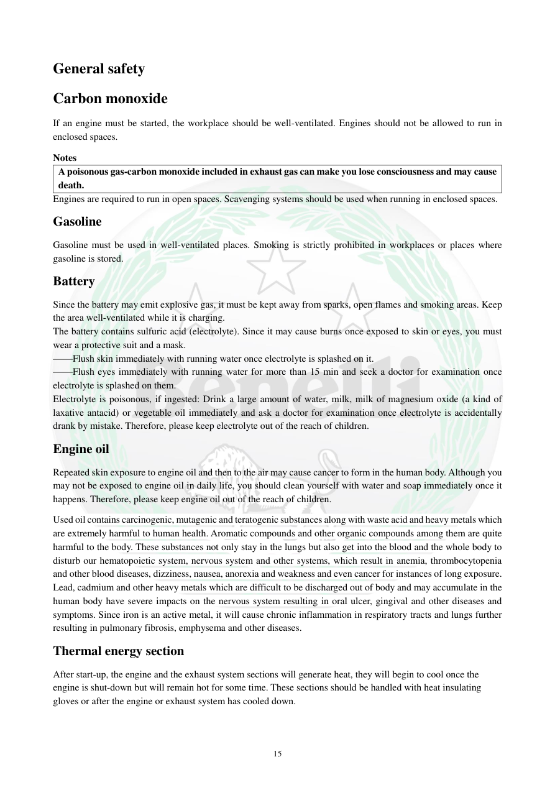

# Manual page 16

> Source: [page-0016.md](../source/page-0016.md)

## Page image / diagram

## Extracted text

# Source page 16

 
15 
General safety 
Carbon monoxide 
If an engine must be started, the workplace should be well-ventilated. Engines should not be allowed to run in 
enclosed spaces. 
Notes 
A poisonous gas-carbon monoxide included in exhaust gas can make you lose consciousness and may cause 
death. 
Engines are required to run in open spaces. Scavenging systems should be used when running in enclosed spaces. 
Gasoline 
Gasoline must be used in well-ventilated places. Smoking is strictly prohibited in workplaces or places where 
gasoline is stored. 
Battery 
Since the battery may emit explosive gas, it must be kept away from sparks, open flames and smoking areas. Keep 
the area well-ventilated while it is charging. 
The battery contains sulfuric acid (electrolyte). Since it may cause burns once exposed to skin or eyes, you must 
wear a protective suit and a mask. 
——Flush skin immediately with running water once electrolyte is splashed on it. 
——Flush eyes immediately with running water for more than 15 min and seek a doctor for examination once 
electrolyte is splashed on them. 
Electrolyte is poisonous, if ingested: Drink a large amount of water, milk, milk of magnesium oxide (a kind of 
laxative antacid) or vegetable oil immediately and ask a doctor for examination once electrolyte is accidentally 
drank by mistake. Therefore, please keep electrolyte out of the reach of children. 
Engine oil 
Repeated skin exposure to engine oil and then to the air may cause cancer to form in the human body. Although you 
may not be exposed to engine oil in daily life, you should clean yourself with water and soap immediately once it 
happens. Therefore, please keep engine oil out of the reach of children.  
Used oil contains carcinogenic, mutagenic and teratogenic substances along with waste acid and heavy metals which 
are extremely harmful to human health. Aromatic compounds and other organic compounds among them are quite 
harmful to the body. These substances not only stay in the lungs but also get into the blood and the whole body to 
disturb our hematopoietic system, nervous system and other systems, which result in anemia, thrombocytopenia 
and other blood diseases, dizziness, nausea, anorexia and weakness and even cancer for instances of long exposure. 
Lead, cadmium and other heavy metals which are difficult to be discharged out of body and may accumulate in the 
human body have severe impacts on the nervous system resulting in oral ulcer, gingival and other diseases and 
symptoms. Since iron is an active metal, it will cause chronic inflammation in respiratory tracts and lungs further 
resulting in pulmonary fibrosis, emphysema and other diseases. 
Thermal energy section 
After start-up, the engine and the exhaust system sections will generate heat, they will begin to cool once the 
engine is shut-down but will remain hot for some time. These sections should be handled with heat insulating 
gloves or after the engine or exhaust system has cooled down.

## Persian notes

### ترجمه و توضیح فارسی
**ایمنی عمومی:** موتور در فضای بسته نباید روشن شود، چون گاز مونوکسیدکربن سمی است. بنزین باید در محل دارای تهویه مناسب و دور از سیگار و شعله استفاده و نگهداری شود. باتری هنگام شارژ می‌تواند گاز انفجاری تولید کند و الکترولیت آن اسیدی و خورنده است؛ تماس با پوست یا چشم نیاز به شست‌وشوی فوری با آب دارد.

روغن موتور، مخصوصاً روغن کارکرده، نباید با پوست تماس طولانی داشته باشد و باید دور از دسترس کودکان نگهداری شود. موتور و اگزوز پس از کار داغ می‌مانند و قبل از لمس باید خنک شوند یا از دستکش عایق حرارت استفاده شود.
