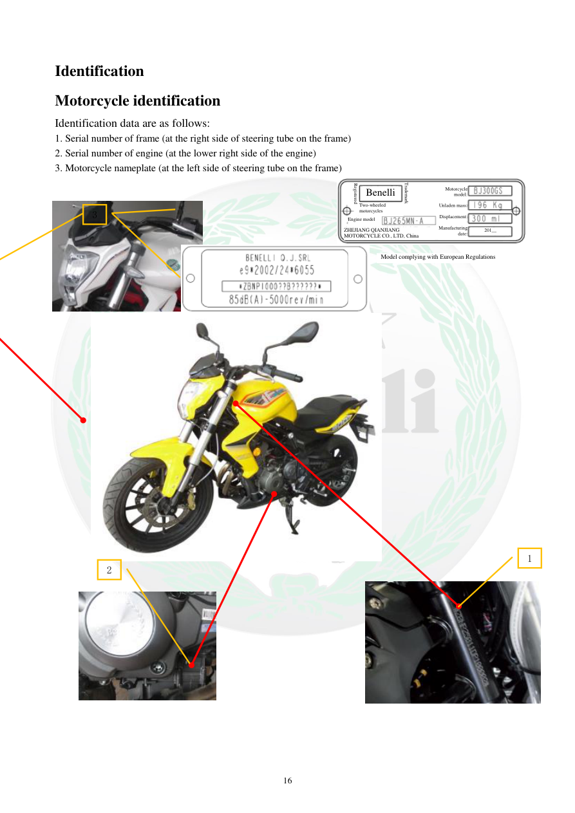

# Manual page 17

> Source: [page-0017.md](../source/page-0017.md)

## Page image / diagram

- [page-0017-img-02.jpeg](../images/embedded/page-0017-img-02.jpeg)

- [page-0017-img-03.jpeg](../images/embedded/page-0017-img-03.jpeg)

- [page-0017-img-04.jpeg](../images/embedded/page-0017-img-04.jpeg)

- [page-0017-img-05.png](../images/embedded/page-0017-img-05.png)

- [page-0017-img-06.png](../images/embedded/page-0017-img-06.png)

- [page-0017-img-07.png](../images/embedded/page-0017-img-07.png)

- [page-0017-img-08.png](../images/embedded/page-0017-img-08.png)

- [page-0017-img-09.png](../images/embedded/page-0017-img-09.png)

- [page-0017-img-10.png](../images/embedded/page-0017-img-10.png)

- [page-0017-img-11.png](../images/embedded/page-0017-img-11.png)

- [page-0017-img-12.png](../images/embedded/page-0017-img-12.png)

- [page-0017-img-13.png](../images/embedded/page-0017-img-13.png)

- [page-0017-img-14.png](../images/embedded/page-0017-img-14.png)

- [page-0017-img-15.png](../images/embedded/page-0017-img-15.png)

- [page-0017-img-16.jpeg](../images/embedded/page-0017-img-16.jpeg)

## Extracted text

# Source page 17

 
16 
Identification 
Motorcycle identification 
Identification data are as follows: 
1. Serial number of frame (at the right side of steering tube on the frame) 
2. Serial number of engine (at the lower right side of the engine) 
3. Motorcycle nameplate (at the left side of steering tube on the frame) 
 
 
 
 
 
 
 
 
 
 
 
 
 
 
 
 
 
 
 
 
 
 
 
 
 
 
 
 
 
 
 
 
 
 
 
 
 
1 
2 
3 
欧规款 
Registered
Trademark
Benelli 
Two-wheeled 
motorcycles 
Engine model 
 
ZHEJIANG QIANJIANG 
MOTORCYCLE CO., LTD, China 
Motorcycle
model
Kerb mass
Delivery
capacity
Manufacturing
date
Motorcycle
model:
Unladen mass:
Displacement:
Manufacturing
date:
201__ 
Model complying with European Regulations

## Persian notes

### ترجمه و توضیح فارسی
**شناسایی موتورسیکلت:** سه مشخصه اصلی معرفی شده‌اند: ۱) شماره شاسی در سمت راست لوله فرمان، ۲) شماره موتور در قسمت پایین سمت راست موتور، ۳) پلاک مشخصات در سمت چپ لوله فرمان شاسی.

پلاک شامل اطلاعاتی مانند مدل، شرکت سازنده، وزن، حجم موتور و تاریخ ساخت است.
