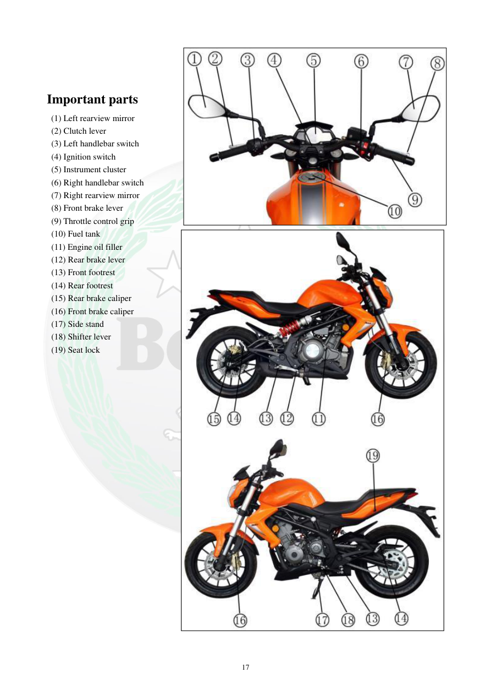

# Manual page 18

> Source: [page-0018.md](../source/page-0018.md)

## Page image / diagram

- [page-0018-img-02.jpeg](../images/embedded/page-0018-img-02.jpeg)

- [page-0018-img-03.jpeg](../images/embedded/page-0018-img-03.jpeg)

## Extracted text

# Source page 18

 
17 
 
Important parts 
(1) Left rearview mirror 
(2) Clutch lever 
(3) Left handlebar switch 
 (4) Ignition switch 
 (5) Instrument cluster 
 (6) Right handlebar switch 
 (7) Right rearview mirror 
 (8) Front brake lever 
 (9) Throttle control grip  
 (10) Fuel tank 
 (11) Engine oil filler 
 (12) Rear brake lever 
 (13) Front footrest 
 (14) Rear footrest 
 (15) Rear brake caliper 
 (16) Front brake caliper 
 (17) Side stand 
 (18) Shifter lever 
 (19) Seat lock

## Persian notes

<!-- Persian translation/explanation will be added here. -->
