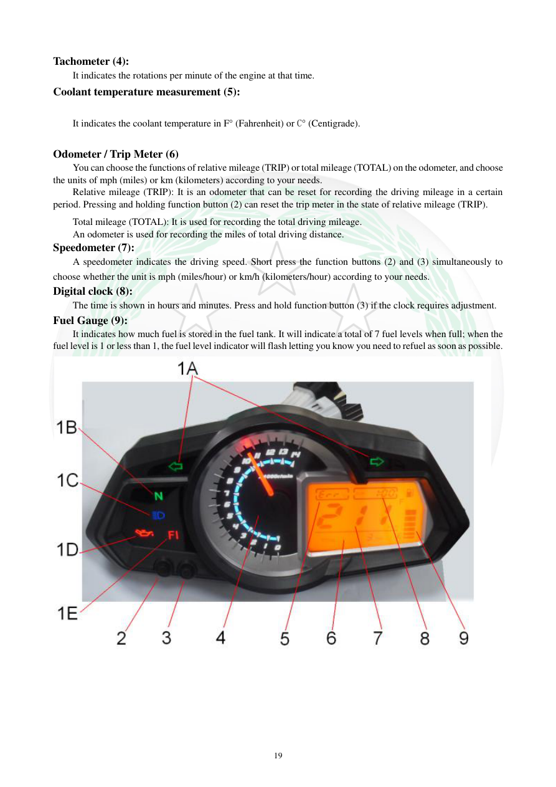

# Manual page 20

> Source: [page-0020.md](../source/page-0020.md)

## Page image / diagram

- [page-0020-img-02.jpeg](../images/embedded/page-0020-img-02.jpeg)

## Extracted text

# Source page 20

 
19 
Tachometer (4): 
It indicates the rotations per minute of the engine at that time. 
Coolant temperature measurement (5): 
It indicates the coolant temperature in F° (Fahrenheit) or C° (Centigrade). 
Odometer / Trip Meter (6) 
You can choose the functions of relative mileage (TRIP) or total mileage (TOTAL) on the odometer, and choose 
the units of mph (miles) or km (kilometers) according to your needs. 
Relative mileage (TRIP): It is an odometer that can be reset for recording the driving mileage in a certain 
period. Pressing and holding function button (2) can reset the trip meter in the state of relative mileage (TRIP). 
Total mileage (TOTAL): It is used for recording the total driving mileage. 
An odometer is used for recording the miles of total driving distance. 
Speedometer (7): 
A speedometer indicates the driving speed. Short press the function buttons (2) and (3) simultaneously to 
choose whether the unit is mph (miles/hour) or km/h (kilometers/hour) according to your needs. 
Digital clock (8): 
The time is shown in hours and minutes. Press and hold function button (3) if the clock requires adjustment. 
Fuel Gauge (9): 
It indicates how much fuel is stored in the fuel tank. It will indicate a total of 7 fuel levels when full; when the 
fuel level is 1 or less than 1, the fuel level indicator will flash letting you know you need to refuel as soon as possible.

## Persian notes

<!-- Persian translation/explanation will be added here. -->
