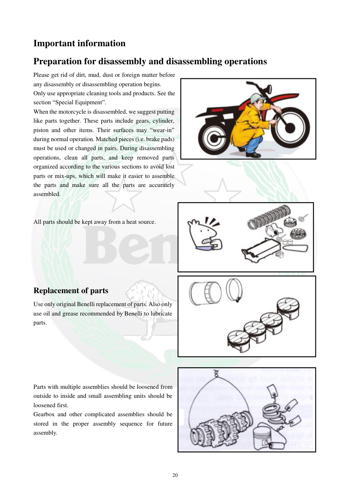

# Manual page 21

> Source: [page-0021.md](../source/page-0021.md)

## Page image / diagram

- [page-0021-img-02.jpeg](../images/embedded/page-0021-img-02.jpeg)

- [page-0021-img-03.jpeg](../images/embedded/page-0021-img-03.jpeg)

- [page-0021-img-04.jpeg](../images/embedded/page-0021-img-04.jpeg)

- [page-0021-img-05.jpeg](../images/embedded/page-0021-img-05.jpeg)

## Extracted text

# Source page 21

 
20 
Important information 
Preparation for disassembly and disassembling operations 
Please get rid of dirt, mud, dust or foreign matter before 
any disassembly or disassembling operation begins. 
Only use appropriate cleaning tools and products. See the 
section “Special Equipment”. 
When the motorcycle is disassembled, we suggest putting 
like parts together. These parts include gears, cylinder, 
piston and other items. Their surfaces may “wear-in” 
during normal operation. Matched pieces (i.e. brake pads) 
must be used or changed in pairs. During disassembling 
operations, clean all parts, and keep removed parts 
organized according to the various sections to avoid lost 
parts or mix-ups, which will make it easier to assemble 
the parts and make sure all the parts are accurately 
assembled. 
 
 
All parts should be kept away from a heat source. 
 
 
 
 
 
 
Replacement of parts 
Use only original Benelli replacement of parts. Also only 
use oil and grease recommended by Benelli to lubricate 
parts. 
 
 
 
 
 
 
Parts with multiple assemblies should be loosened from 
outside to inside and small assembling units should be 
loosened first. 
Gearbox and other complicated assemblies should be 
stored in the proper assembly sequence for future 
assembly.

## Persian notes

### ترجمه و توضیح فارسی
**آماده‌سازی برای باز کردن قطعات:** قبل از هر بازکردنی گل‌ولای، گردوغبار و آلودگی را تمیز کنید و از ابزار و مواد شوینده مناسب استفاده کنید. قطعات جفت‌شونده مانند چرخ‌دنده‌ها، سیلندر و پیستون را مرتب و جداگانه نگهداری کنید؛ قطعاتی مانند لنت ترمز باید به‌صورت جفت تعویض شوند.

قطعات را دور از منبع حرارت نگه دارید. برای تعویض، قطعات اصلی Benelli و روغن و گریس توصیه‌شده استفاده شود. مجموعه‌های چندقطعه‌ای از بیرون به داخل و زیرمجموعه‌های کوچک ابتدا باز شوند. مجموعه گیربکس باید به ترتیب مونتاژ نگهداری شود.
