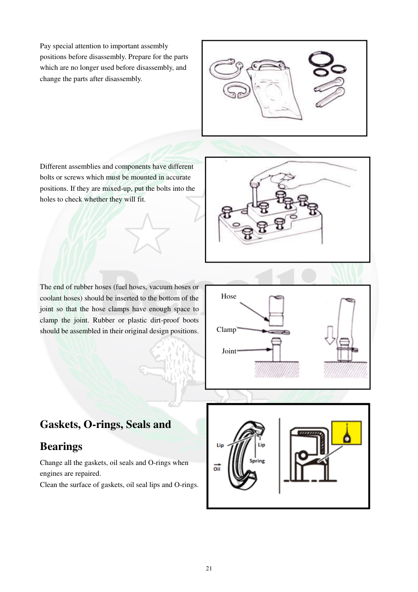

# Manual page 22

> Source: [page-0022.md](../source/page-0022.md)

## Page image / diagram

- [page-0022-img-02.png](../images/embedded/page-0022-img-02.png)

- [page-0022-img-03.jpeg](../images/embedded/page-0022-img-03.jpeg)

- [page-0022-img-04.jpeg](../images/embedded/page-0022-img-04.jpeg)

- [page-0022-img-05.png](../images/embedded/page-0022-img-05.png)

## Extracted text

# Source page 22

 
21 
Pay special attention to important assembly 
positions before disassembly. Prepare for the parts 
which are no longer used before disassembly, and 
change the parts after disassembly. 
 
 
 
 
 
 
 
Different assemblies and components have different 
bolts or screws which must be mounted in accurate 
positions. If they are mixed-up, put the bolts into the 
holes to check whether they will fit. 
 
 
 
 
 
 
 
The end of rubber hoses (fuel hoses, vacuum hoses or 
coolant hoses) should be inserted to the bottom of the 
joint so that the hose clamps have enough space to 
clamp the joint. Rubber or plastic dirt-proof boots 
should be assembled in their original design positions. 
 
 
 
 
 
 
 
Gaskets, O-rings, Seals and 
Bearings 
Change all the gaskets, oil seals and O-rings when 
engines are repaired. 
Clean the surface of gaskets, oil seal lips and O-rings. 
 
 
 
Hose 
 
 
Clamp 
 
Joint

## Persian notes

### ترجمه و توضیح فارسی
قبل از بازکردن، موقعیت‌های مهم مونتاژ را مشخص کنید و قطعاتی را که پس از بازشدن باید تعویض شوند آماده داشته باشید. پیچ‌ها و بست‌های متفاوت را با محل خود قاطی نکنید. شیلنگ‌های سوخت، خلأ و خنک‌کننده باید تا انتهای اتصال وارد شوند تا بست فضای کافی برای محکم‌کردن داشته باشد.

واشرها، کاسه‌نمدها و اورینگ‌ها هنگام تعمیر موتور تعویض شوند و سطوح آب‌بندی تمیز باشند.
