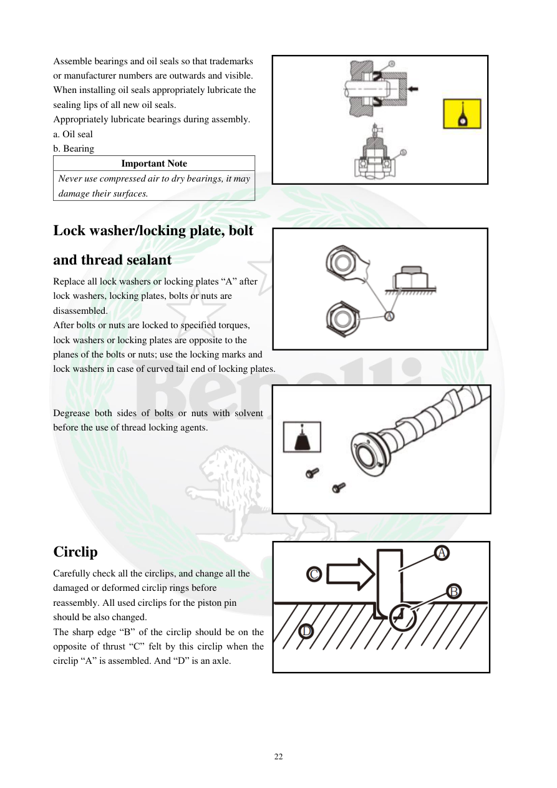

# Manual page 23

> Source: [page-0023.md](../source/page-0023.md)

## Page image / diagram

- [page-0023-img-02.png](../images/embedded/page-0023-img-02.png)

- [page-0023-img-03.jpeg](../images/embedded/page-0023-img-03.jpeg)

- [page-0023-img-04.jpeg](../images/embedded/page-0023-img-04.jpeg)

- [page-0023-img-05.png](../images/embedded/page-0023-img-05.png)

## Extracted text

# Source page 23

 
22 
Assemble bearings and oil seals so that trademarks 
or manufacturer numbers are outwards and visible. 
When installing oil seals appropriately lubricate the 
sealing lips of all new oil seals. 
Appropriately lubricate bearings during assembly. 
a. Oil seal 
b. Bearing 
Important Note 
Never use compressed air to dry bearings, it may 
damage their surfaces. 
 
Lock washer/locking plate, bolt 
and thread sealant 
Replace all lock washers or locking plates “A” after 
lock washers, locking plates, bolts or nuts are 
disassembled. 
After bolts or nuts are locked to specified torques, 
lock washers or locking plates are opposite to the 
planes of the bolts or nuts; use the locking marks and 
lock washers in case of curved tail end of locking plates. 
 
 
Degrease both sides of bolts or nuts with solvent 
before the use of thread locking agents. 
 
 
 
 
 
 
 
Circlip 
Carefully check all the circlips, and change all the 
damaged or deformed circlip rings before 
reassembly. All used circlips for the piston pin 
should be also changed. 
The sharp edge “B” of the circlip should be on the 
opposite of thrust “C” felt by this circlip when the 
circlip “A” is assembled. And “D” is an axle.

## Persian notes

<!-- Persian translation/explanation will be added here. -->
