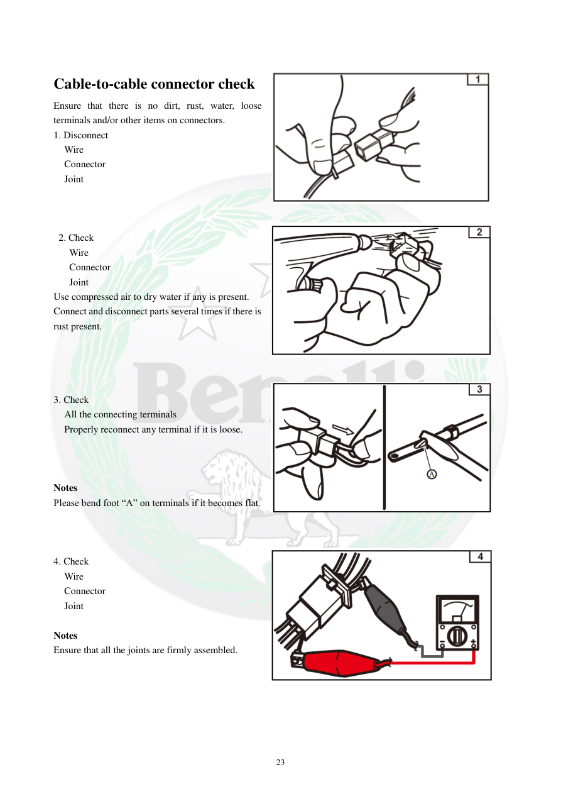

# Manual page 24

> Source: [page-0024.md](../source/page-0024.md)

## Page image / diagram

- [page-0024-img-02.png](../images/embedded/page-0024-img-02.png)

- [page-0024-img-03.png](../images/embedded/page-0024-img-03.png)

- [page-0024-img-04.png](../images/embedded/page-0024-img-04.png)

- [page-0024-img-05.png](../images/embedded/page-0024-img-05.png)

## Extracted text

# Source page 24

 
23 
 
Cable-to-cable connector check 
Ensure that there is no dirt, rust, water, loose 
terminals and/or other items on connectors. 
1. Disconnect 
Wire 
Connector 
Joint 
 
 
 
 2. Check 
 Wire 
 Connector 
 Joint 
Use compressed air to dry water if any is present. 
Connect and disconnect parts several times if there is 
rust present. 
 
 
 
 
3. Check 
All the connecting terminals 
Properly reconnect any terminal if it is loose. 
 
 
 
Notes 
Please bend foot “A” on terminals if it becomes flat.  
 
 
 
4. Check 
Wire 
Connector 
Joint 
 
Notes 
Ensure that all the joints are firmly assembled.

## Persian notes

<!-- Persian translation/explanation will be added here. -->
