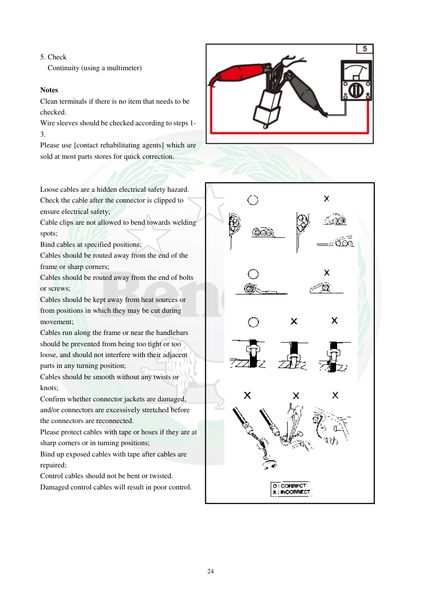

# Manual page 25

> Source: [page-0025.md](../source/page-0025.md)

## Page image / diagram

- [page-0025-img-02.png](../images/embedded/page-0025-img-02.png)

- [page-0025-img-03.png](../images/embedded/page-0025-img-03.png)

## Extracted text

# Source page 25

 
24 
 
5. Check 
  Continuity (using a multimeter) 
 
Notes 
Clean terminals if there is no item that needs to be 
checked. 
Wire sleeves should be checked according to steps 1-
3. 
Please use [contact rehabilitating agents] which are 
sold at most parts stores for quick correction. 
 
 
Loose cables are a hidden electrical safety hazard. 
Check the cable after the connector is clipped to 
ensure electrical safety; 
Cable clips are not allowed to bend towards welding 
spots; 
Bind cables at specified positions; 
Cables should be routed away from the end of the 
frame or sharp corners; 
Cables should be routed away from the end of bolts 
or screws; 
Cables should be kept away from heat sources or 
from positions in which they may be cut during 
movement; 
Cables run along the frame or near the handlebars 
should be prevented from being too tight or too 
loose, and should not interfere with their adjacent 
parts in any turning position; 
Cables should be smooth without any twists or 
knots; 
Confirm whether connector jackets are damaged, 
and/or connectors are excessively stretched before 
the connectors are reconnected.  
Please protect cables with tape or hoses if they are at 
sharp corners or in turning positions; 
Bind up exposed cables with tape after cables are 
repaired; 
Control cables should not be bent or twisted. 
Damaged control cables will result in poor control.

## Persian notes

### ترجمه و توضیح فارسی
ادامه بررسی سیم و کانکتور: پیوستگی مدار با مولتی‌متر کنترل شود و ترمینال‌های آلوده تمیز شوند. سیم‌ها نباید شل، پیچ‌خورده یا تحت کشش باشند و باید از لبه‌های تیز، انتهای پیچ‌ها، نقاط داغ و محل‌های ساییده‌شدن دور نگه داشته شوند.

سیم‌های نزدیک فرمان نباید بیش از حد کشیده یا شل باشند و نباید با قطعات مجاور در هیچ وضعیت چرخش فرمان تداخل داشته باشند. روکش و بدنه کانکتورها نیز از نظر آسیب و کشیدگی بیش از حد بررسی شوند. کابل‌های کنترلی نباید خم یا پیچانده شوند، چون آسیب آنها می‌تواند کنترل موتورسیکلت را مختل کند.
