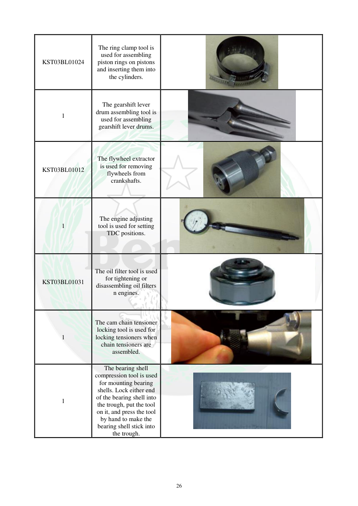

# Manual page 27

> Source: [page-0027.md](../source/page-0027.md)

## Page image / diagram

- [page-0027-img-02.jpeg](../images/embedded/page-0027-img-02.jpeg)

- [page-0027-img-03.jpeg](../images/embedded/page-0027-img-03.jpeg)

- [page-0027-img-04.jpeg](../images/embedded/page-0027-img-04.jpeg)

- [page-0027-img-05.jpeg](../images/embedded/page-0027-img-05.jpeg)

- [page-0027-img-06.jpeg](../images/embedded/page-0027-img-06.jpeg)

- [page-0027-img-07.jpeg](../images/embedded/page-0027-img-07.jpeg)

- [page-0027-img-08.jpeg](../images/embedded/page-0027-img-08.jpeg)

## Extracted text

# Source page 27

 
26 
KST03BL01024 
The ring clamp tool is 
used for assembling 
piston rings on pistons 
and inserting them into 
the cylinders. 
1 
The gearshift lever 
drum assembling tool is 
used for assembling 
gearshift lever drums. 
KST03BL01012 
The flywheel extractor 
is used for removing 
flywheels from 
crankshafts. 
 
1 
The engine adjusting 
tool is used for setting 
TDC positions. 
 
KST03BL01031 
The oil filter tool is used 
for tightening or 
disassembling oil filters 
n engines. 
 
1 
The cam chain tensioner 
locking tool is used for 
locking tensioners when 
chain tensioners are 
assembled. 
 
1 
The bearing shell 
compression tool is used 
for mounting bearing 
shells. Lock either end 
of the bearing shell into 
the trough, put the tool 
on it, and press the tool 
by hand to make the 
bearing shell stick into 
the trough.

## Persian notes

<!-- Persian translation/explanation will be added here. -->
