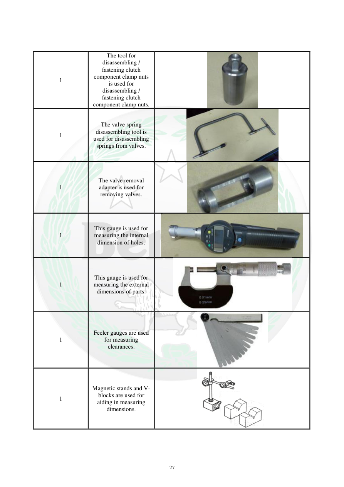

# Manual page 28

> Source: [page-0028.md](../source/page-0028.md)

## Page image / diagram

- [page-0028-img-02.png](../images/embedded/page-0028-img-02.png)

- [page-0028-img-03.jpeg](../images/embedded/page-0028-img-03.jpeg)

- [page-0028-img-04.jpeg](../images/embedded/page-0028-img-04.jpeg)

- [page-0028-img-05.jpeg](../images/embedded/page-0028-img-05.jpeg)

- [page-0028-img-06.jpeg](../images/embedded/page-0028-img-06.jpeg)

- [page-0028-img-07.jpeg](../images/embedded/page-0028-img-07.jpeg)

- [page-0028-img-08.jpeg](../images/embedded/page-0028-img-08.jpeg)

## Extracted text

# Source page 28

 
27 
 
 
1 
The tool for 
disassembling / 
fastening clutch 
component clamp nuts 
is used for 
disassembling / 
fastening clutch 
component clamp nuts. 
1 
The valve spring 
disassembling tool is 
used for disassembling 
springs from valves. 
1 
The valve removal 
adapter is used for 
removing valves. 
1 
This gauge is used for 
measuring the internal 
dimension of holes. 
1 
This gauge is used for 
measuring the external 
dimensions of parts. 
 
1 
Feeler gauges are used 
for measuring 
clearances.  
 
1 
Magnetic stands and V-
blocks are used for 
aiding in measuring 
dimensions.

## Persian notes

### ترجمه و توضیح فارسی
ابزارهای اندازه‌گیری و تعمیر شامل ابزار مهره‌های کلاچ، ابزار جمع‌کردن فنر سوپاپ، آداپتور خارج‌کردن سوپاپ، گیج اندازه‌گیری قطر داخلی سوراخ، ابزار اندازه‌گیری قطر خارجی، فیلر گیج برای اندازه‌گیری لقی و پایه مغناطیسی و V-block برای اندازه‌گیری دقیق معرفی شده‌اند.
