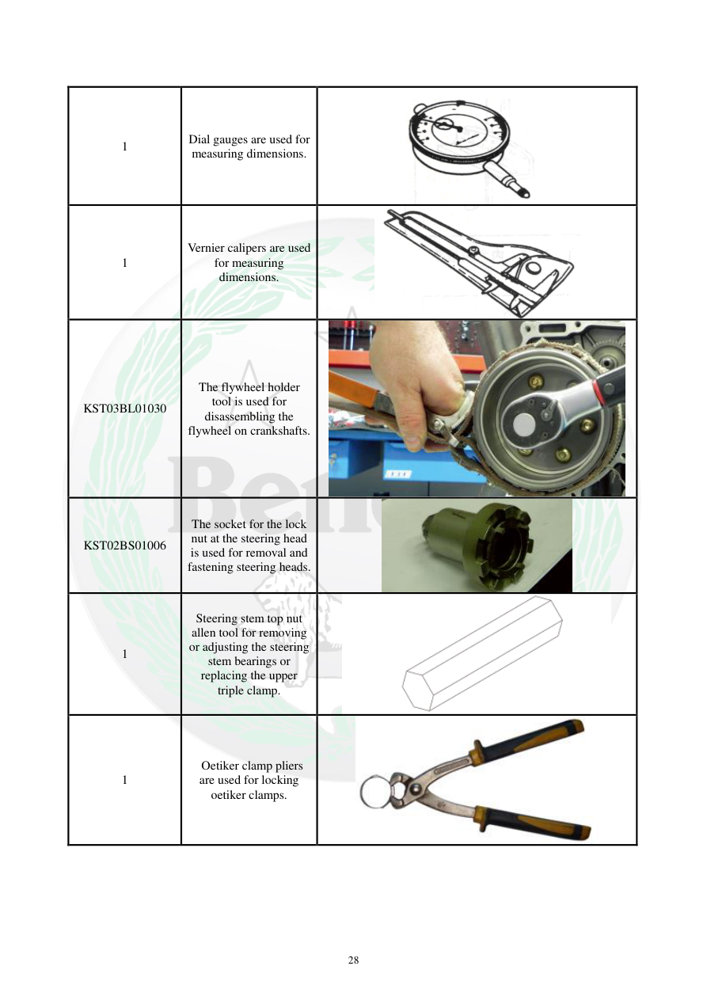

# Manual page 29

> Source: [page-0029.md](../source/page-0029.md)

## Page image / diagram

- [page-0029-img-02.png](../images/embedded/page-0029-img-02.png)

- [page-0029-img-03.png](../images/embedded/page-0029-img-03.png)

- [page-0029-img-04.png](../images/embedded/page-0029-img-04.png)

- [page-0029-img-05.jpeg](../images/embedded/page-0029-img-05.jpeg)

- [page-0029-img-06.jpeg](../images/embedded/page-0029-img-06.jpeg)

- [page-0029-img-07.jpeg](../images/embedded/page-0029-img-07.jpeg)

## Extracted text

# Source page 29

 
28 
 
1 
Dial gauges are used for 
measuring dimensions. 
1 
Vernier calipers are used 
for measuring 
dimensions. 
KST03BL01030 
The flywheel holder 
tool is used for 
disassembling the 
flywheel on crankshafts. 
KST02BS01006 
The socket for the lock 
nut at the steering head 
is used for removal and 
fastening steering heads. 
1 
Steering stem top nut 
allen tool for removing 
or adjusting the steering 
stem bearings or 
replacing the upper 
triple clamp. 
1 
 Oetiker clamp pliers 
are used for locking 
oetiker clamps.

## Persian notes

<!-- Persian translation/explanation will be added here. -->
