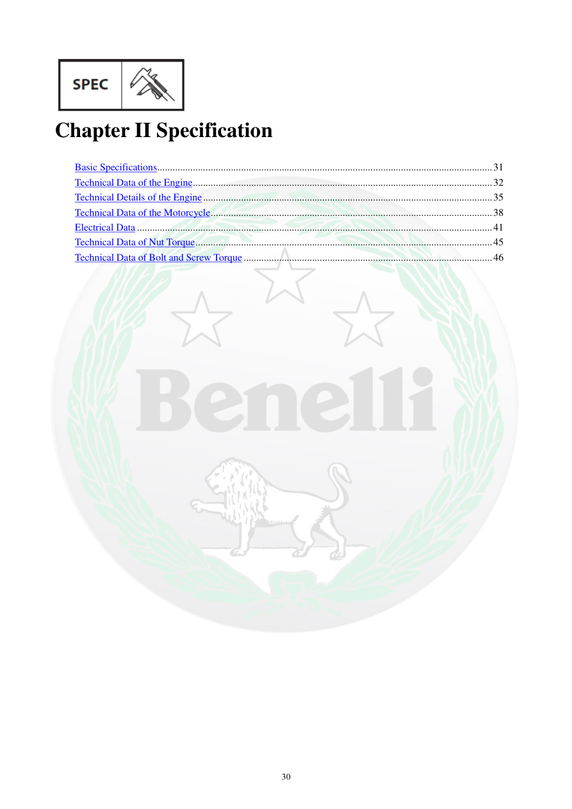

# Manual page 31

> Source: [page-0031.md](../source/page-0031.md)

## Page image / diagram

## Extracted text

# Source page 31

 
30 
 
Chapter II Specification 
 
Basic Specifications .................................................................................................................................... 31 
Technical Data of the Engine ...................................................................................................................... 32 
Technical Details of the Engine .................................................................................................................. 35 
Technical Data of the Motorcycle ............................................................................................................... 38 
Electrical Data ............................................................................................................................................ 41 
Technical Data of Nut Torque ..................................................................................................................... 45 
Technical Data of Bolt and Screw Torque .................................................................................................. 46

## Persian notes

### ترجمه و توضیح فارسی
**فصل دوم: مشخصات فنی** شامل ابعاد و وزن پایه، مشخصات موتور، جزئیات فنی موتور، مشخصات موتورسیکلت، داده‌های الکتریکی و جداول گشتاور سفت‌کردن مهره‌ها، پیچ‌ها و پیچ‌های رزوه‌دار است.

اعداد این فصل باید به‌عنوان مقادیر مرجع مدل TNT300 در نظر گرفته شوند.
