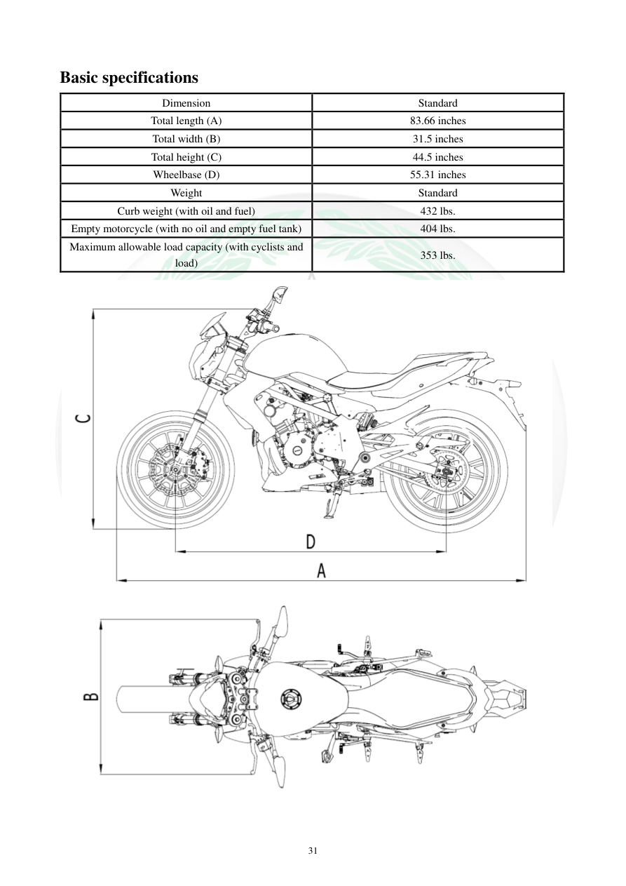

# Manual page 32

> Source: [page-0032.md](../source/page-0032.md)

## Page image / diagram

- [page-0032-img-02.png](../images/embedded/page-0032-img-02.png)

## Extracted text

# Source page 32

 
31 
Basic specifications 
Dimension 
Standard 
Total length (A) 
83.66 inches 
Total width (B) 
31.5 inches 
Total height (C) 
44.5 inches 
Wheelbase (D) 
55.31 inches 
Weight 
Standard 
Curb weight (with oil and fuel) 
432 lbs. 
Empty motorcycle (with no oil and empty fuel tank) 
404 lbs. 
Maximum allowable load capacity (with cyclists and 
load) 
353 lbs.

## Persian notes

### ترجمه و توضیح فارسی
**ابعاد و وزن TNT300:** طول کلی 83.66 اینچ، عرض 31.5 اینچ، ارتفاع 44.5 اینچ و فاصله محوری 55.31 اینچ است. وزن با روغن و سوخت 432 پوند، وزن بدون روغن و باک خالی 404 پوند و حداکثر ظرفیت بار مجاز شامل موتورسوار و بار 353 پوند اعلام شده است.

> این اعداد مستقیماً از جدول مشخصات TNT300 استخراج شده‌اند.
