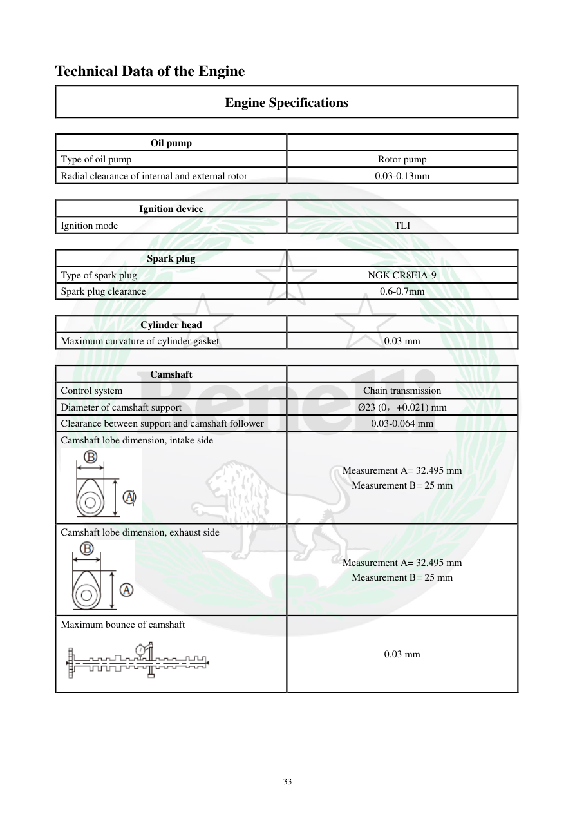

# Manual page 34

> Source: [page-0034.md](../source/page-0034.md)

## Page image / diagram

- [page-0034-img-02.png](../images/embedded/page-0034-img-02.png)

- [page-0034-img-03.png](../images/embedded/page-0034-img-03.png)

- [page-0034-img-04.png](../images/embedded/page-0034-img-04.png)

## Extracted text

# Source page 34

 
33 
Technical Data of the Engine 
Engine Specifications 
 
Oil pump 
 
Type of oil pump 
Rotor pump 
Radial clearance of internal and external rotor 
0.03-0.13mm 
 
Ignition device 
 
Ignition mode 
TLI 
 
Spark plug 
 
Type of spark plug 
NGK CR8EIA-9 
Spark plug clearance 
0.6-0.7mm 
 
Cylinder head 
 
Maximum curvature of cylinder gasket 
0.03 mm 
 
Camshaft 
 
Control system 
Chain transmission 
Diameter of camshaft support 
Ø23 (0，+0.021) mm 
Clearance between support and camshaft follower 
0.03-0.064 mm 
Camshaft lobe dimension, intake side 
 
Measurement A= 32.495 mm 
Measurement B= 25 mm 
Camshaft lobe dimension, exhaust side 
 
Measurement A= 32.495 mm 
Measurement B= 25 mm 
Maximum bounce of camshaft 
 
0.03 mm

## Persian notes

<!-- Persian translation/explanation will be added here. -->
