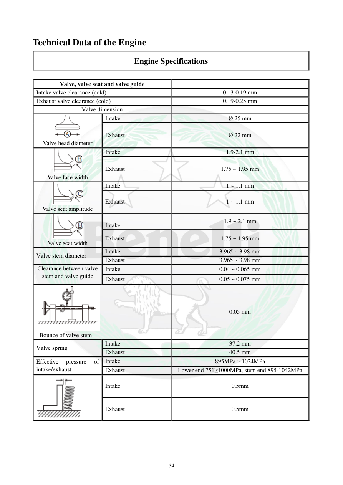

# Manual page 35

> Source: [page-0035.md](../source/page-0035.md)

## Page image / diagram

- [page-0035-img-02.png](../images/embedded/page-0035-img-02.png)

- [page-0035-img-03.png](../images/embedded/page-0035-img-03.png)

- [page-0035-img-04.png](../images/embedded/page-0035-img-04.png)

- [page-0035-img-05.png](../images/embedded/page-0035-img-05.png)

- [page-0035-img-06.png](../images/embedded/page-0035-img-06.png)

- [page-0035-img-07.png](../images/embedded/page-0035-img-07.png)

## Extracted text

# Source page 35

 
34 
Technical Data of the Engine 
Engine Specifications 
 
Valve, valve seat and valve guide 
 
Intake valve clearance (cold) 
0.13-0.19 mm 
Exhaust valve clearance (cold) 
0.19-0.25 mm 
Valve dimension 
 
  
Valve head diameter 
Intake 
Ø 25 mm 
Exhaust 
Ø 22 mm 
  
Valve face width 
Intake 
1.9-2.1 mm 
Exhaust 
1.75 ~ 1.95 mm 
  
Valve seat amplitude 
Intake 
1 ~ 1.1 mm 
Exhaust 
1 ~ 1.1 mm 
  
Valve seat width 
 
Intake 
1.9 ~ 2.1 mm 
Exhaust 
1.75 ~ 1.95 mm 
Valve stem diameter 
Intake 
3.965 ~ 3.98 mm 
Exhaust 
3.965 ~ 3.98 mm 
Clearance between valve 
stem and valve guide 
Intake 
0.04 ~ 0.065 mm 
Exhaust 
0.05 ~ 0.075 mm 
 
 Bounce of valve stem 
0.05 mm 
Valve spring 
Intake 
37.2 mm 
Exhaust 
40.5 mm 
Effective 
pressure 
of 
intake/exhaust 
Intake 
895MPa～1024MPa 
Exhaust 
Lower end 751≥1000MPa, stem end 895-1042MPa 
 
Intake 
0.5mm 
Exhaust 
0.5mm

## Persian notes

<!-- Persian translation/explanation will be added here. -->
