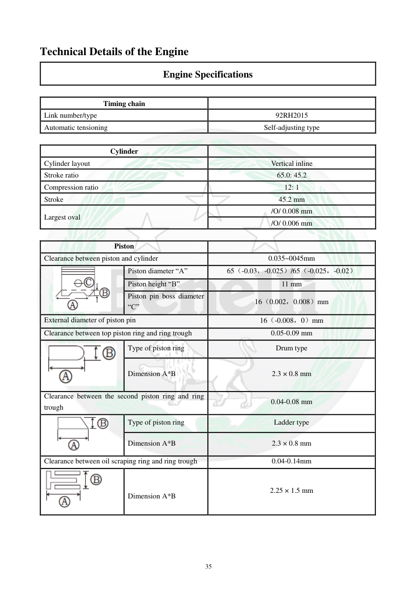

# Manual page 36

> Source: [page-0036.md](../source/page-0036.md)

## Page image / diagram

- [page-0036-img-02.png](../images/embedded/page-0036-img-02.png)

- [page-0036-img-03.png](../images/embedded/page-0036-img-03.png)

- [page-0036-img-04.png](../images/embedded/page-0036-img-04.png)

- [page-0036-img-05.png](../images/embedded/page-0036-img-05.png)

## Extracted text

# Source page 36

 
35 
Technical Details of the Engine 
Engine Specifications 
 
Timing chain 
 
Link number/type 
92RH2015 
Automatic tensioning 
Self-adjusting type 
 
Cylinder 
 
Cylinder layout 
Vertical inline 
Stroke ratio 
65.0: 45.2 
Compression ratio 
12: 1 
Stroke 
45.2 mm 
Largest oval 
/O/ 0.008 mm 
/O/ 0.006 mm 
 
Piston 
 
Clearance between piston and cylinder 
0.035~0045mm 
 
Piston diameter “A” 
65（-0.03，-0.025）/65（-0.025，-0.02） 
Piston height “B” 
11 mm 
Piston pin boss diameter 
“C” 
16（0.002，0.008）mm 
External diameter of piston pin 
16（-0.008，0）mm 
Clearance between top piston ring and ring trough 
0.05-0.09 mm 
 
Type of piston ring 
Drum type 
Dimension A*B 
2.3 × 0.8 mm 
Clearance between the second piston ring and ring 
trough 
0.04-0.08 mm 
 
Type of piston ring 
Ladder type 
Dimension A*B 
2.3 × 0.8 mm 
Clearance between oil scraping ring and ring trough 
0.04-0.14mm 
 
 
Dimension A*B 
2.25 × 1.5 mm

## Persian notes

### ترجمه و توضیح فارسی
زنجیر تایم از نوع **92RH2015** با سفت‌کن خودتنظیم است. قطر سیلندر 65.0 mm و کورس 45.2 mm و نسبت تراکم 12:1 است. برای بیضی‌شدن سیلندر، لقی پیستون و سیلندر، ابعاد پیستون، پین پیستون و لقی رینگ‌ها حدود مشخص شده است.

رینگ‌ها شامل رینگ اول، رینگ دوم و رینگ روغنی هستند و برای هرکدام ضخامت/ابعاد و لقی با شیار پیستون در جدول آمده است.
