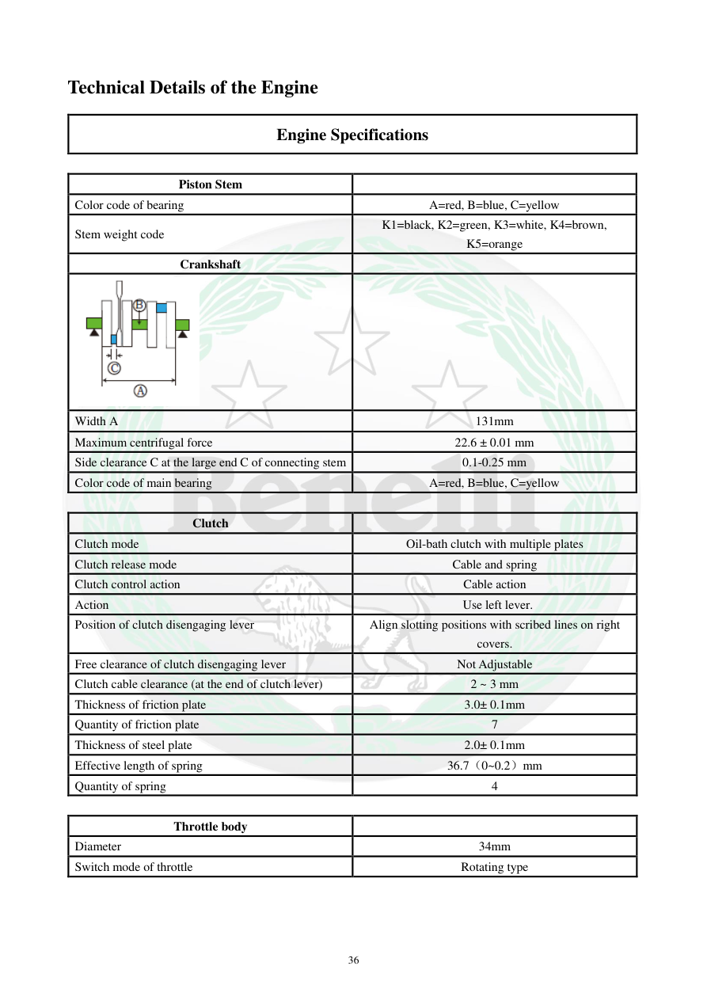

# Manual page 37

> Source: [page-0037.md](../source/page-0037.md)

## Page image / diagram

- [page-0037-img-02.png](../images/embedded/page-0037-img-02.png)

## Extracted text

# Source page 37

 
36 
Technical Details of the Engine 
Engine Specifications 
 
Piston Stem 
 
Color code of bearing 
A=red, B=blue, C=yellow 
Stem weight code 
K1=black, K2=green, K3=white, K4=brown, 
K5=orange 
Crankshaft 
 
 
 
Width A 
131mm 
Maximum centrifugal force 
22.6 ± 0.01 mm 
Side clearance C at the large end C of connecting stem 
0.1-0.25 mm 
Color code of main bearing 
A=red, B=blue, C=yellow 
 
Clutch 
 
Clutch mode 
Oil-bath clutch with multiple plates 
Clutch release mode 
Cable and spring 
Clutch control action 
Cable action 
Action 
Use left lever. 
Position of clutch disengaging lever 
Align slotting positions with scribed lines on right 
covers. 
Free clearance of clutch disengaging lever 
Not Adjustable 
Clutch cable clearance (at the end of clutch lever) 
2 ~ 3 mm 
Thickness of friction plate 
3.0± 0.1mm 
Quantity of friction plate 
7 
Thickness of steel plate 
2.0± 0.1mm 
Effective length of spring 
36.7（0~0.2）mm 
Quantity of spring 
4 
 
Throttle body 
 
Diameter 
34mm 
Switch mode of throttle 
Rotating type

## Persian notes

### ترجمه و توضیح فارسی
کد رنگ یاتاقان‌ها: A قرمز، B آبی و C زرد. کد وزن شاتون/اجزای مربوطه نیز با K1 تا K5 مشخص شده است.

**کلاچ:** نوع روغنی چندصفحه‌ای است، آزادسازی با کابل و فنر انجام می‌شود و کنترل با اهرم سمت چپ است. لقی کابل در انتهای اهرم 2 تا 3 mm، ضخامت صفحه اصطکاکی 3.0±0.1 mm، تعداد صفحات اصطکاکی 7 عدد، ضخامت صفحه فولادی 2.0±0.1 mm و تعداد فنرها 4 عدد است. قطر دریچه گاز 34 mm است.
