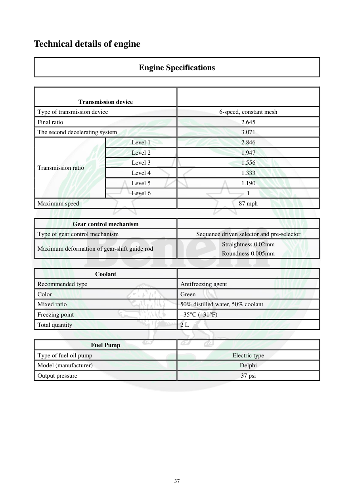

# Manual page 38

> Source: [page-0038.md](../source/page-0038.md)

## Page image / diagram

## Extracted text

# Source page 38

 
37 
Technical details of engine 
Engine Specifications 
 
 
Transmission device 
 
Type of transmission device 
6-speed, constant mesh 
Final ratio 
2.645 
The second decelerating system 
3.071 
Transmission ratio 
Level 1 
2.846 
Level 2 
1.947 
Level 3 
1.556 
Level 4 
1.333 
Level 5 
1.190 
Level 6 
1 
Maximum speed 
87 mph 
 
Gear control mechanism 
 
Type of gear control mechanism 
Sequence driven selector and pre-selector 
Maximum deformation of gear-shift guide rod 
Straightness 0.02mm 
Roundness 0.005mm 
 
Coolant 
 
Recommended type 
Antifreezing agent  
Color 
Green 
Mixed ratio 
50% distilled water, 50% coolant 
Freezing point 
–35°C (–31°F) 
Total quantity 
2 L 
 
Fuel Pump 
 
Type of fuel oil pump 
Electric type 
Model (manufacturer) 
Delphi 
Output pressure 
37 psi

## Persian notes

### ترجمه و توضیح فارسی
گیربکس **۶ سرعته دائم‌درگیر** است و نسبت‌های دنده 1 تا 6 در جدول آمده‌اند. حداکثر سرعت اعلام‌شده 87 mph است. مکانیزم تعویض دنده از نوع ترتیبی است.

**مایع خنک‌کننده:** نوع ضدیخ، رنگ سبز، نسبت اختلاط 50٪ آب مقطر و 50٪ خنک‌کننده، نقطه انجماد حدود ‎-35°C و ظرفیت کل 2 L. پمپ سوخت برقی Delphi با فشار خروجی 37 psi معرفی شده است.
