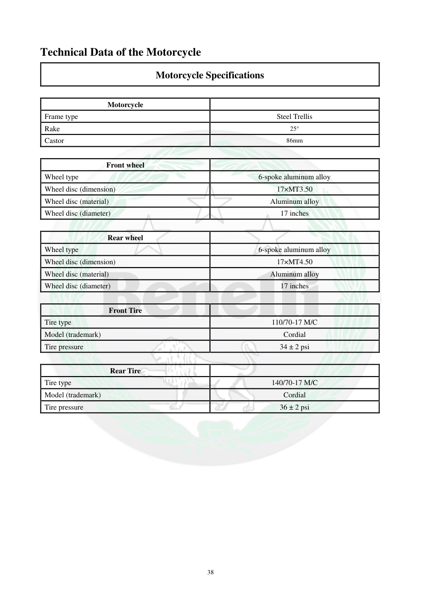

# Manual page 39

> Source: [page-0039.md](../source/page-0039.md)

## Page image / diagram

## Extracted text

# Source page 39

 
38 
Technical Data of the Motorcycle 
Motorcycle Specifications  
 
Motorcycle 
 
Frame type 
Steel Trellis 
Rake 
25° 
Castor 
86mm 
 
Front wheel 
 
Wheel type 
6-spoke aluminum alloy 
Wheel disc (dimension) 
17×MT3.50 
Wheel disc (material) 
Aluminum alloy 
Wheel disc (diameter) 
17 inches 
 
Rear wheel 
 
Wheel type 
6-spoke aluminum alloy 
Wheel disc (dimension) 
17×MT4.50 
Wheel disc (material) 
Aluminum alloy 
Wheel disc (diameter) 
17 inches 
 
Front Tire 
 
Tire type 
110/70-17 M/C 
Model (trademark) 
Cordial 
Tire pressure 
34 ± 2 psi 
 
Rear Tire 
 
Tire type 
140/70-17 M/C 
Model (trademark) 
Cordial 
Tire pressure 
36 ± 2 psi

## Persian notes

### ترجمه و توضیح فارسی
**شاسی و چرخ‌ها:** فریم از نوع Steel Trellis با زاویه فرمان 25° و Trail برابر 86 mm است. چرخ جلو و عقب آلیاژ آلومینیوم 6 پره و 17 اینچ هستند. سایز تایر جلو 110/70-17 و عقب 140/70-17 است. فشار پیشنهادی درج‌شده در دفترچه برای جلو 34±2 psi و عقب 36±2 psi است.

این مقادیر متعلق به جدول مشخصات TNT300 هستند.
