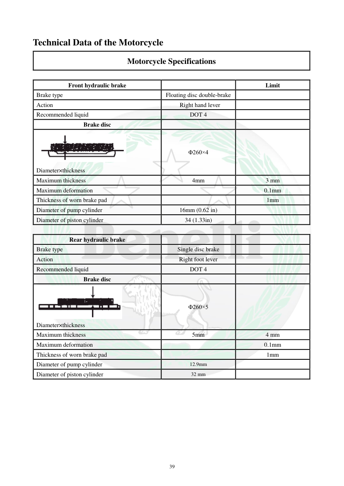

# Manual page 40

> Source: [page-0040.md](../source/page-0040.md)

## Page image / diagram

- [page-0040-img-02.png](../images/embedded/page-0040-img-02.png)

- [page-0040-img-03.png](../images/embedded/page-0040-img-03.png)

## Extracted text

# Source page 40

 
39 
Technical Data of the Motorcycle 
Motorcycle Specifications  
 
Front hydraulic brake 
 
Limit 
Brake type 
Floating disc double-brake 
 
Action 
 Right hand lever 
 
Recommended liquid 
DOT 4 
 
Brake disc 
 
 
Diameter×thickness 
Φ260×4 
 
Maximum thickness 
4mm 
3 mm 
Maximum deformation 
 
0.1mm 
Thickness of worn brake pad 
 
1mm 
Diameter of pump cylinder 
16mm (0.62 in) 
 
Diameter of piston cylinder 
34 (1.33in) 
 
 
Rear hydraulic brake 
 
 
Brake type 
Single disc brake 
 
Action 
Right foot lever 
 
Recommended liquid 
DOT 4 
 
Brake disc 
 
 
Diameter×thickness 
Φ260×5 
 
Maximum thickness 
5mm 
4 mm 
Maximum deformation 
 
0.1mm 
Thickness of worn brake pad 
 
1mm 
Diameter of pump cylinder 
12.9mm 
 
Diameter of piston cylinder 
32 mm

## Persian notes

<!-- Persian translation/explanation will be added here. -->
