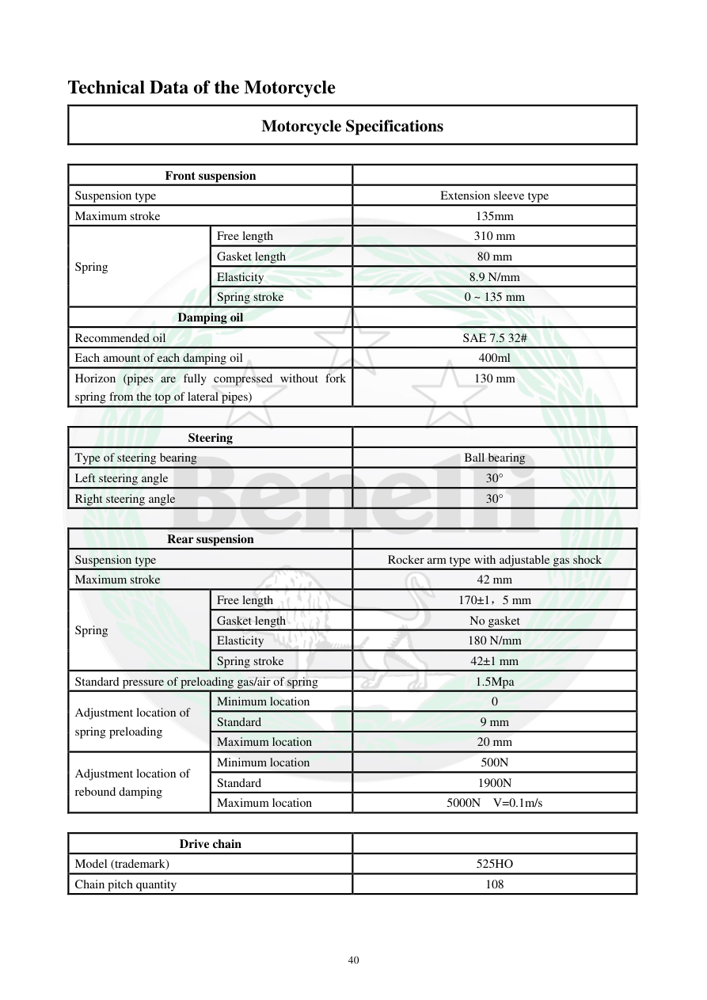

# Manual page 41

> Source: [page-0041.md](../source/page-0041.md)

## Page image / diagram

## Extracted text

# Source page 41

 
40 
Technical Data of the Motorcycle 
Motorcycle Specifications  
 
Front suspension 
 
Suspension type 
Extension sleeve type 
Maximum stroke 
135mm 
Spring 
Free length 
310 mm 
Gasket length 
80 mm 
Elasticity 
8.9 N/mm 
Spring stroke 
0 ~ 135 mm 
Damping oil 
 
Recommended oil 
SAE 7.5 32# 
Each amount of each damping oil 
400ml 
Horizon (pipes are fully compressed without fork 
spring from the top of lateral pipes) 
130 mm 
 
Steering 
 
Type of steering bearing 
Ball bearing 
Left steering angle 
30° 
Right steering angle 
30° 
 
Rear suspension 
 
Suspension type 
Rocker arm type with adjustable gas shock 
Maximum stroke 
42 mm 
Spring 
Free length 
170±1，5 mm 
Gasket length 
No gasket 
Elasticity 
180 N/mm 
Spring stroke 
42±1 mm 
Standard pressure of preloading gas/air of spring 
1.5Mpa 
Adjustment location of 
spring preloading 
Minimum location 
0 
Standard 
9 mm 
Maximum location 
20 mm 
Adjustment location of 
rebound damping 
Minimum location 
500N 
Standard 
1900N 
Maximum location 
5000N  V=0.1m/s 
 
Drive chain 
 
Model (trademark) 
525HO 
Chain pitch quantity 
108

## Persian notes

<!-- Persian translation/explanation will be added here. -->
