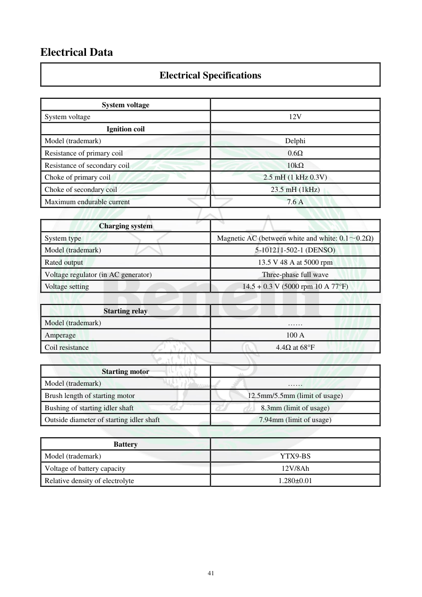

# Manual page 42

> Source: [page-0042.md](../source/page-0042.md)

## Page image / diagram

## Extracted text

# Source page 42

 
41 
Electrical Data 
Electrical Specifications 
 
System voltage 
 
System voltage 
12V 
Ignition coil 
 
Model (trademark) 
Delphi 
Resistance of primary coil 
0.6Ω 
Resistance of secondary coil 
10kΩ 
Choke of primary coil 
2.5 mH (1 kHz 0.3V) 
Choke of secondary coil 
23.5 mH (1kHz) 
Maximum endurable current 
7.6 A 
 
Charging system 
 
System type 
Magnetic AC (between white and white: 0.1～0.2Ω) 
Model (trademark) 
5-101211-502-1 (DENSO) 
Rated output 
13.5 V 48 A at 5000 rpm 
Voltage regulator (in AC generator) 
Three-phase full wave 
Voltage setting 
14.5 + 0.3 V (5000 rpm 10 A 77°F) 
 
Starting relay 
 
Model (trademark) 
…… 
Amperage 
100 A 
Coil resistance 
4.4Ω at 68°F 
 
Starting motor 
 
Model (trademark) 
…… 
Brush length of starting motor 
12.5mm/5.5mm (limit of usage) 
Bushing of starting idler shaft 
8.3mm (limit of usage) 
Outside diameter of starting idler shaft 
7.94mm (limit of usage) 
 
Battery 
 
Model (trademark) 
YTX9-BS 
Voltage of battery capacity 
12V/8Ah 
Relative density of electrolyte 
1.280±0.01

## Persian notes

<!-- Persian translation/explanation will be added here. -->
