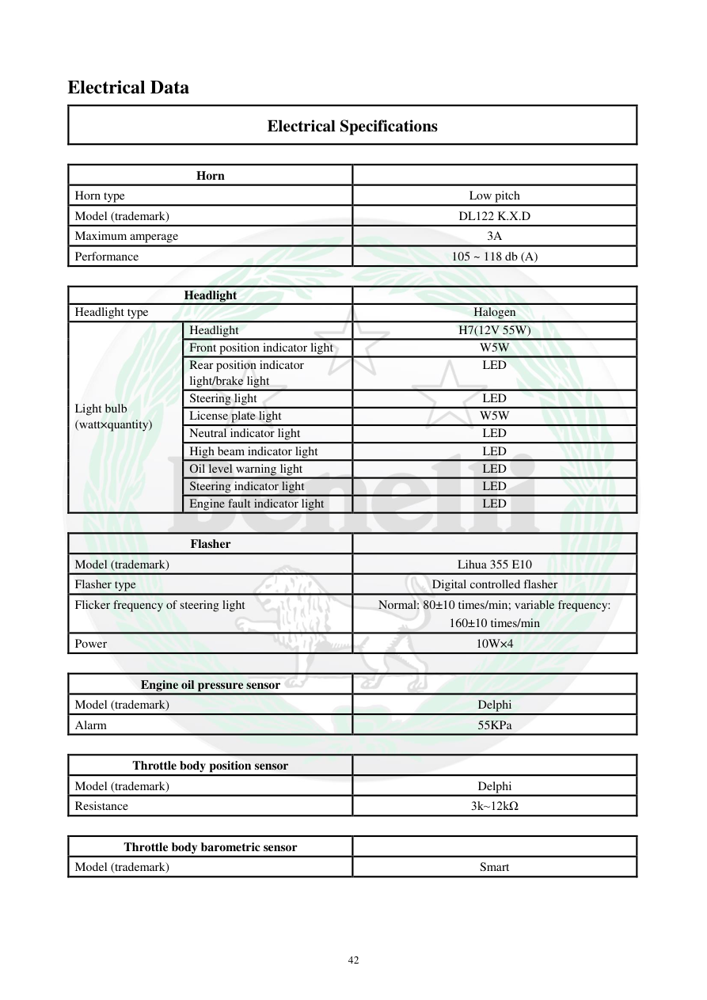

# Manual page 43

> Source: [page-0043.md](../source/page-0043.md)

## Page image / diagram

## Extracted text

# Source page 43

 
42 
Electrical Data 
Electrical Specifications 
 
Horn 
 
Horn type 
Low pitch 
Model (trademark) 
DL122 K.X.D 
Maximum amperage 
3A 
Performance 
105 ~ 118 db (A) 
 
Headlight 
 
Headlight type 
Halogen 
Light bulb 
(watt×quantity) 
Headlight 
H7(12V 55W) 
Front position indicator light 
W5W 
Rear position indicator 
light/brake light 
LED 
Steering light 
LED 
License plate light 
W5W 
Neutral indicator light 
LED 
High beam indicator light 
LED 
Oil level warning light 
LED 
Steering indicator light 
LED 
Engine fault indicator light 
LED 
 
Flasher 
 
Model (trademark) 
Lihua 355 E10 
Flasher type 
Digital controlled flasher 
Flicker frequency of steering light 
Normal: 80±10 times/min; variable frequency: 
160±10 times/min 
Power 
10W×4 
 
Engine oil pressure sensor 
 
Model (trademark) 
Delphi 
Alarm 
55KPa 
 
Throttle body position sensor 
 
Model (trademark) 
Delphi 
Resistance 
3k~12kΩ 
 
Throttle body barometric sensor 
 
Model (trademark) 
Smart

## Persian notes

### ترجمه و توضیح فارسی
مشخصات بوق، چراغ‌ها و سنسورها در این صفحه آمده است. چراغ جلو هالوژن **H7، 12V 55W** است؛ چراغ موقعیت جلو و پلاک W5W هستند و بسیاری از چراغ‌های نشانگر و عقب LED هستند.

فلشر دیجیتال با فرکانس عادی حدود 80±10 بار در دقیقه و حالت متغیر 160±10 بار در دقیقه است. سنسور فشار روغن Delphi، سنسور موقعیت دریچه گاز Delphi با مقاومت 3k تا 12kΩ و سنسور فشار هوای دریچه گاز نیز در جدول معرفی شده‌اند.
