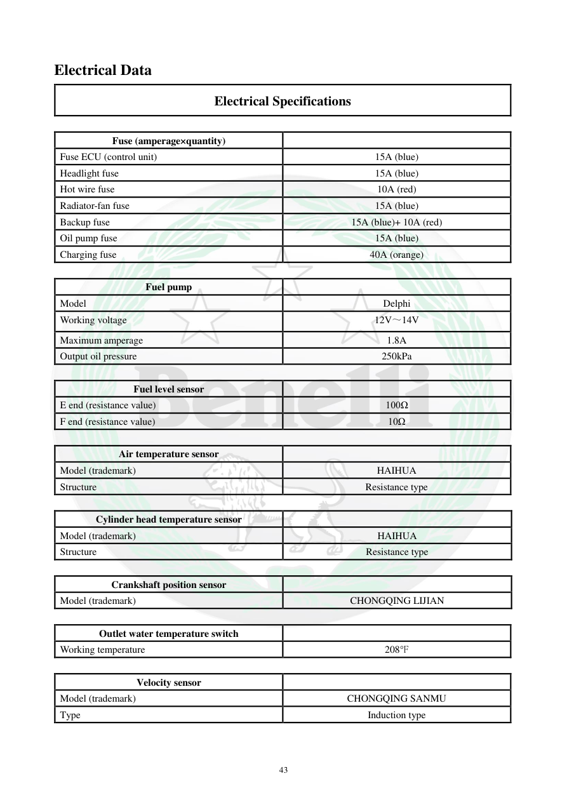

# Manual page 44

> Source: [page-0044.md](../source/page-0044.md)

## Page image / diagram

## Extracted text

# Source page 44

 
43 
Electrical Data 
Electrical Specifications 
 
Fuse (amperage×quantity) 
 
Fuse ECU (control unit) 
15A (blue) 
Headlight fuse 
15A (blue) 
Hot wire fuse 
10A (red) 
Radiator-fan fuse 
15A (blue) 
Backup fuse 
15A (blue)+ 10A (red) 
Oil pump fuse 
15A (blue) 
Charging fuse 
40A (orange) 
 
Fuel pump 
 
Model 
Delphi 
Working voltage 
12V～14V 
Maximum amperage 
1.8A 
Output oil pressure 
250kPa 
 
Fuel level sensor 
 
E end (resistance value) 
100Ω 
F end (resistance value) 
10Ω 
 
Air temperature sensor 
 
Model (trademark) 
HAIHUA 
Structure 
Resistance type 
 
Cylinder head temperature sensor 
 
Model (trademark) 
HAIHUA 
Structure 
Resistance type 
 
Crankshaft position sensor 
 
Model (trademark) 
CHONGQING LIJIAN 
 
Outlet water temperature switch 
 
Working temperature 
208°F 
 
Velocity sensor 
 
Model (trademark) 
CHONGQING SANMU 
Type 
Induction type

## Persian notes

### ترجمه و توضیح فارسی
**فیوزها:** فیوز ECU برابر 15A، چراغ جلو 15A، برق اصلی 10A، فن رادیاتور 15A، فیوز پشتیبان 15A+10A، مدار پمپ روغن 15A و شارژ 40A است.

پمپ سوخت Delphi با ولتاژ کاری 12 تا 14V، جریان حداکثر 1.8A و فشار خروجی 250 kPa معرفی شده است. مقاومت سنسور سطح سوخت در حالت E برابر 100Ω و در F برابر 10Ω است. سنسورهای دما مقاومتی‌اند و سنسور موقعیت میل‌لنگ و سنسور سرعت نیز مشخص شده‌اند.
