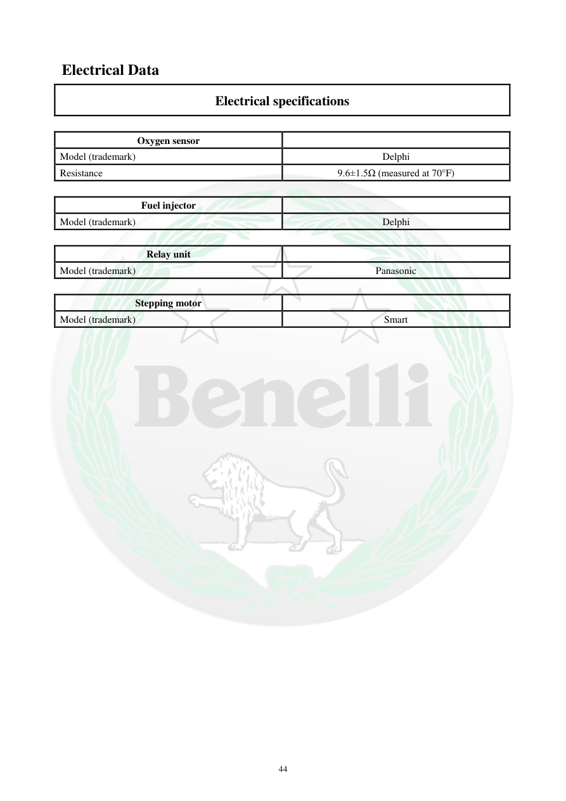

# Manual page 45

> Source: [page-0045.md](../source/page-0045.md)

## Page image / diagram

## Extracted text

# Source page 45

 
44 
 Electrical Data 
Electrical specifications 
 
Oxygen sensor 
 
Model (trademark) 
Delphi 
Resistance 
9.6±1.5Ω (measured at 70°F) 
 
Fuel injector 
 
Model (trademark) 
Delphi 
 
Relay unit 
 
Model (trademark) 
Panasonic 
 
Stepping motor 
 
Model (trademark) 
Smart

## Persian notes

<!-- Persian translation/explanation will be added here. -->
