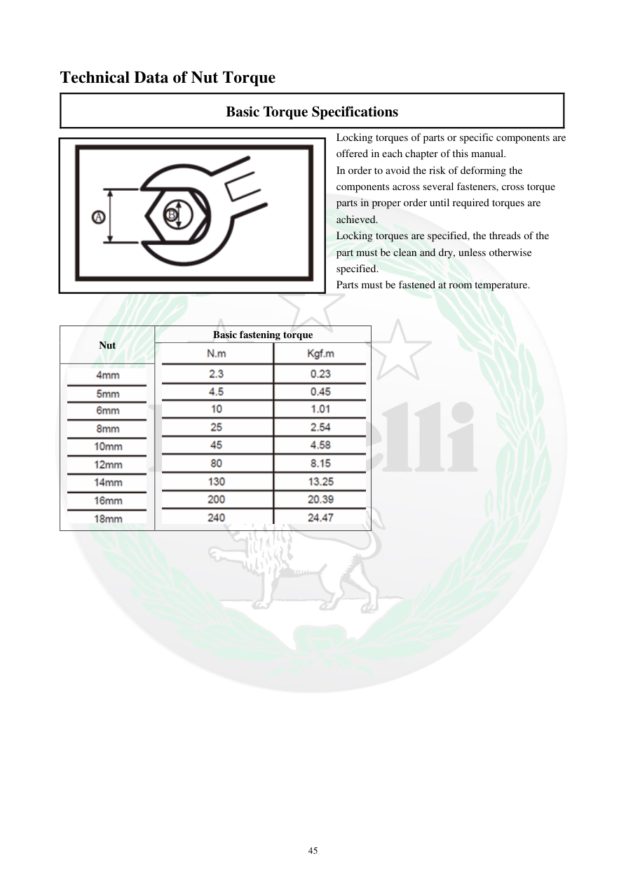

# Manual page 46

> Source: [page-0046.md](../source/page-0046.md)

## Page image / diagram

- [page-0046-img-02.png](../images/embedded/page-0046-img-02.png)

- [page-0046-img-03.png](../images/embedded/page-0046-img-03.png)

- [page-0046-img-04.png](../images/embedded/page-0046-img-04.png)

## Extracted text

# Source page 46

 
45 
Technical Data of Nut Torque 
Basic Torque Specifications 
Locking torques of parts or specific components are 
offered in each chapter of this manual. 
In order to avoid the risk of deforming the 
components across several fasteners, cross torque 
parts in proper order until required torques are 
achieved. 
Locking torques are specified, the threads of the 
part must be clean and dry, unless otherwise 
specified. 
Parts must be fastened at room temperature. 
 
 
Nut 
Basic fastening torque

## Persian notes

### ترجمه و توضیح فارسی
**مشخصات پایه گشتاور مهره‌ها:** گشتاور اختصاصی قطعات در فصل مربوط به همان قطعه ارائه می‌شود. برای قطعاتی که چند پیچ دارند، پیچ‌ها باید به‌صورت ضربدری و مرحله‌ای سفت شوند تا فشار یکنواخت ایجاد شود.

مگر اینکه دستور دیگری داده شده باشد، رزوه باید تمیز و خشک باشد و قطعه در دمای محیط سفت شود. جدول این صفحه عنوان بخش گشتاورهای پایه مهره‌ها را معرفی می‌کند.
