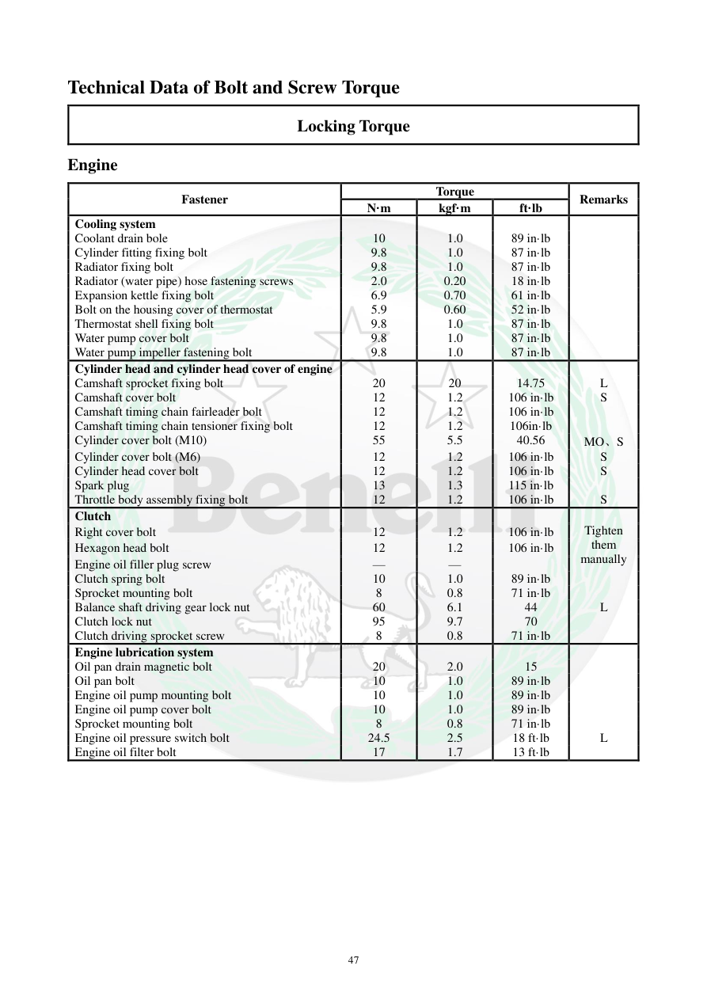

# Manual page 48

> Source: [page-0048.md](../source/page-0048.md)

## Page image / diagram

## Extracted text

# Source page 48

 
47 
Technical Data of Bolt and Screw Torque 
Locking Torque 
Engine 
Fastener 
Torque 
Remarks 
N·m 
kgf·m 
ft·lb 
Cooling system 
 
 
 
 
Coolant drain bole 
10 
1.0 
89 in·lb 
 
Cylinder fitting fixing bolt 
9.8 
1.0 
87 in·lb 
 
Radiator fixing bolt 
9.8 
1.0 
87 in·lb 
 
Radiator (water pipe) hose fastening screws 
2.0 
0.20 
18 in·lb 
 
Expansion kettle fixing bolt 
6.9 
0.70 
61 in·lb 
 
Bolt on the housing cover of thermostat 
5.9 
0.60 
52 in·lb 
 
Thermostat shell fixing bolt 
9.8 
1.0 
87 in·lb 
 
Water pump cover bolt 
9.8 
1.0 
87 in·lb 
 
Water pump impeller fastening bolt 
9.8 
1.0 
87 in·lb 
 
Cylinder head and cylinder head cover of engine 
 
 
 
 
Camshaft sprocket fixing bolt 
20 
20 
14.75 
L 
Camshaft cover bolt 
12 
1.2 
106 in·lb 
S 
Camshaft timing chain fairleader bolt 
12 
1.2 
106 in·lb 
 
Camshaft timing chain tensioner fixing bolt 
12 
1.2 
106in·lb 
 
Cylinder cover bolt (M10) 
55 
5.5 
40.56 
MO、S 
Cylinder cover bolt (M6) 
12 
1.2 
106 in·lb 
S 
Cylinder head cover bolt 
12 
1.2 
106 in·lb 
S 
Spark plug 
13 
1.3 
115 in·lb 
 
Throttle body assembly fixing bolt 
12 
1.2 
106 in·lb 
S 
Clutch 
 
 
 
 
Tighten 
them 
manually 
Right cover bolt 
12 
1.2 
106 in·lb 
Hexagon head bolt 
12 
1.2 
106 in·lb 
Engine oil filler plug screw 
— 
— 
 
Clutch spring bolt 
10 
1.0 
89 in·lb 
 
Sprocket mounting bolt 
8 
0.8 
71 in·lb 
 
Balance shaft driving gear lock nut 
60 
6.1 
44  
L 
Clutch lock nut 
95 
9.7 
70 
 
Clutch driving sprocket screw 
8 
0.8 
71 in·lb 
 
Engine lubrication system 
 
 
 
 
Oil pan drain magnetic bolt 
20 
2.0 
15 
 
Oil pan bolt 
10 
1.0 
89 in·lb 
 
Engine oil pump mounting bolt 
10 
1.0 
89 in·lb 
 
Engine oil pump cover bolt 
10 
1.0 
89 in·lb 
 
Sprocket mounting bolt 
8 
0.8 
71 in·lb 
 
Engine oil pressure switch bolt 
24.5 
2.5 
18 ft·lb 
L 
Engine oil filter bolt 
17 
1.7 
13 ft·lb

## Persian notes

<!-- Persian translation/explanation will be added here. -->
