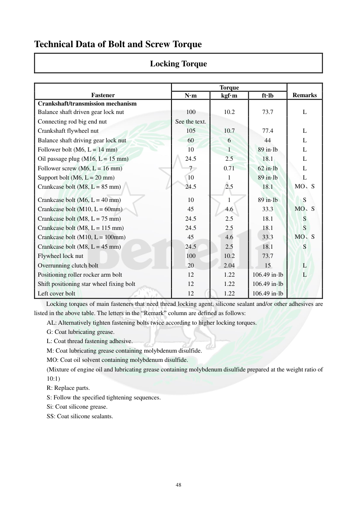

# Manual page 49

> Source: [page-0049.md](../source/page-0049.md)

## Page image / diagram

## Extracted text

# Source page 49

 
48 
Technical Data of Bolt and Screw Torque 
Locking Torque 
 
 
Fastener 
Torque 
 
Remarks 
N·m 
kgf·m 
ft·lb 
Crankshaft/transmission mechanism 
 
 
 
 
Balance shaft driven gear lock nut 
100 
10.2 
73.7 
L 
Connecting rod big end nut 
See the text. 
 
 
 
Crankshaft flywheel nut 
105 
10.7 
77.4 
L 
Balance shaft driving gear lock nut 
60 
6 
44 
L 
Follower bolt (M6, L = 14 mm) 
10 
1 
89 in·lb 
L 
Oil passage plug (M16, L = 15 mm) 
24.5 
2.5 
18.1 
L 
Follower screw (M6, L = 16 mm) 
7 
0.71 
62 in·lb 
L 
Support bolt (M6, L = 20 mm) 
10 
1 
89 in·lb 
L 
Crankcase bolt (M8, L = 85 mm) 
24.5 
2.5 
18.1 
MO、S 
Crankcase bolt (M6, L = 40 mm) 
10 
1 
89 in·lb 
S 
Crankcase bolt (M10, L = 60mm) 
45 
4.6 
33.3 
MO、S 
Crankcase bolt (M8, L = 75 mm) 
24.5 
2.5 
18.1 
S 
Crankcase bolt (M8, L = 115 mm) 
24.5 
2.5 
18.1 
S 
Crankcase bolt (M10, L = 100mm) 
45 
4.6 
33.3 
MO、S 
Crankcase bolt (M8, L = 45 mm) 
24.5 
2.5 
18.1 
S 
Flywheel lock nut 
100 
10.2 
73.7 
 
Overrunning clutch bolt 
20 
2.04 
15 
L 
Positioning roller rocker arm bolt 
12 
1.22 
106.49 in·lb 
L 
Shift positioning star wheel fixing bolt 
12 
1.22 
106.49 in·lb 
 
Left cover bolt 
12 
1.22 
106.49 in·lb 
 
Locking torques of main fasteners that need thread locking agent, silicone sealant and/or other adhesives are 
listed in the above table. The letters in the “Remark” column are defined as follows: 
AL: Alternatively tighten fastening bolts twice according to higher locking torques. 
G: Coat lubricating grease. 
L: Coat thread fastening adhesive. 
M: Coat lubricating grease containing molybdenum disulfide. 
MO: Coat oil solvent containing molybdenum disulfide. 
(Mixture of engine oil and lubricating grease containing molybdenum disulfide prepared at the weight ratio of 
10:1) 
R: Replace parts. 
S: Follow the specified tightening sequences. 
Si: Coat silicone grease. 
SS: Coat silicone sealants.

## Persian notes

<!-- Persian translation/explanation will be added here. -->
