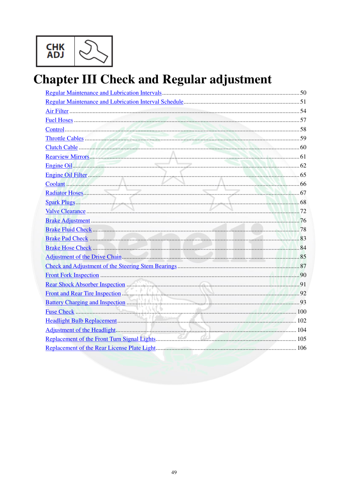

# Manual page 50

> Source: [page-0050.md](../source/page-0050.md)

## Page image / diagram

## Extracted text

# Source page 50

 
49 
 
Chapter III Check and Regular adjustment 
Regular Maintenance and Lubrication Intervals ......................................................................................... 50 
Regular Maintenance and Lubrication Interval Schedule ........................................................................... 51 
Air Filter ..................................................................................................................................................... 54 
Fuel Hoses .................................................................................................................................................. 57 
Control ........................................................................................................................................................ 58 
Throttle Cables ........................................................................................................................................... 59 
Clutch Cable ............................................................................................................................................... 60 
Rearview Mirrors ........................................................................................................................................ 61 
Engine Oil ................................................................................................................................................... 62 
Engine Oil Filter ......................................................................................................................................... 65 
Coolant ....................................................................................................................................................... 66 
Radiator Hoses ............................................................................................................................................ 67 
Spark Plugs ................................................................................................................................................. 68 
Valve Clearance .......................................................................................................................................... 72 
Brake Adjustment ....................................................................................................................................... 76 
Brake Fluid Check ...................................................................................................................................... 78 
Brake Pad Check ........................................................................................................................................ 83 
Brake Hose Check ...................................................................................................................................... 84 
Adjustment of the Drive Chain ................................................................................................................... 85 
Check and Adjustment of the Steering Stem Bearings ............................................................................... 87 
Front Fork Inspection ................................................................................................................................. 90 
Rear Shock Absorber Inspection ................................................................................................................ 91 
Front and Rear Tire Inspection ................................................................................................................... 92 
Battery Charging and Inspection ................................................................................................................ 93 
Fuse Check ............................................................................................................................................... 100 
Headlight Bulb Replacement .................................................................................................................... 102 
Adjustment of the Headlight ..................................................................................................................... 104 
Replacement of the Front Turn Signal Lights ........................................................................................... 105 
Replacement of the Rear License Plate Light ........................................................................................... 106

## Persian notes

<!-- Persian translation/explanation will be added here. -->
