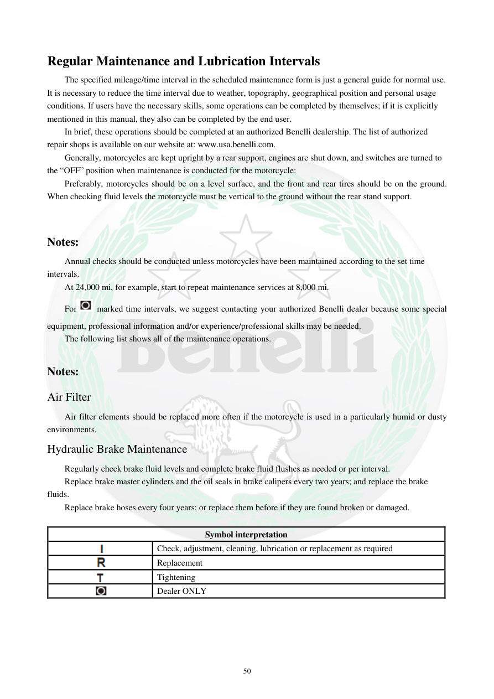

# Manual page 51

> Source: [page-0051.md](../source/page-0051.md)

## Page image / diagram

- [page-0051-img-02.png](../images/embedded/page-0051-img-02.png)

- [page-0051-img-03.png](../images/embedded/page-0051-img-03.png)

- [page-0051-img-04.png](../images/embedded/page-0051-img-04.png)

- [page-0051-img-05.png](../images/embedded/page-0051-img-05.png)

## Extracted text

# Source page 51

 
50 
Regular Maintenance and Lubrication Intervals 
The specified mileage/time interval in the scheduled maintenance form is just a general guide for normal use. 
It is necessary to reduce the time interval due to weather, topography, geographical position and personal usage 
conditions. If users have the necessary skills, some operations can be completed by themselves; if it is explicitly 
mentioned in this manual, they also can be completed by the end user. 
In brief, these operations should be completed at an authorized Benelli dealership. The list of authorized 
repair shops is available on our website at: www.usa.benelli.com. 
Generally, motorcycles are kept upright by a rear support, engines are shut down, and switches are turned to 
the “OFF” position when maintenance is conducted for the motorcycle:  
Preferably, motorcycles should be on a level surface, and the front and rear tires should be on the ground. 
When checking fluid levels the motorcycle must be vertical to the ground without the rear stand support. 
 
 
Notes: 
Annual checks should be conducted unless motorcycles have been maintained according to the set time 
intervals. 
At 24,000 mi, for example, start to repeat maintenance services at 8,000 mi. 
For
 marked time intervals, we suggest contacting your authorized Benelli dealer because some special 
equipment, professional information and/or experience/professional skills may be needed. 
The following list shows all of the maintenance operations. 
 
Notes: 
Air Filter 
Air filter elements should be replaced more often if the motorcycle is used in a particularly humid or dusty 
environments. 
Hydraulic Brake Maintenance 
Regularly check brake fluid levels and complete brake fluid flushes as needed or per interval. 
Replace brake master cylinders and the oil seals in brake calipers every two years; and replace the brake 
fluids. 
Replace brake hoses every four years; or replace them before if they are found broken or damaged. 
 
Symbol interpretation 
 
Check, adjustment, cleaning, lubrication or replacement as required 
 
Replacement 
 
Tightening 
 
Dealer ONLY

## Persian notes

<!-- Persian translation/explanation will be added here. -->
