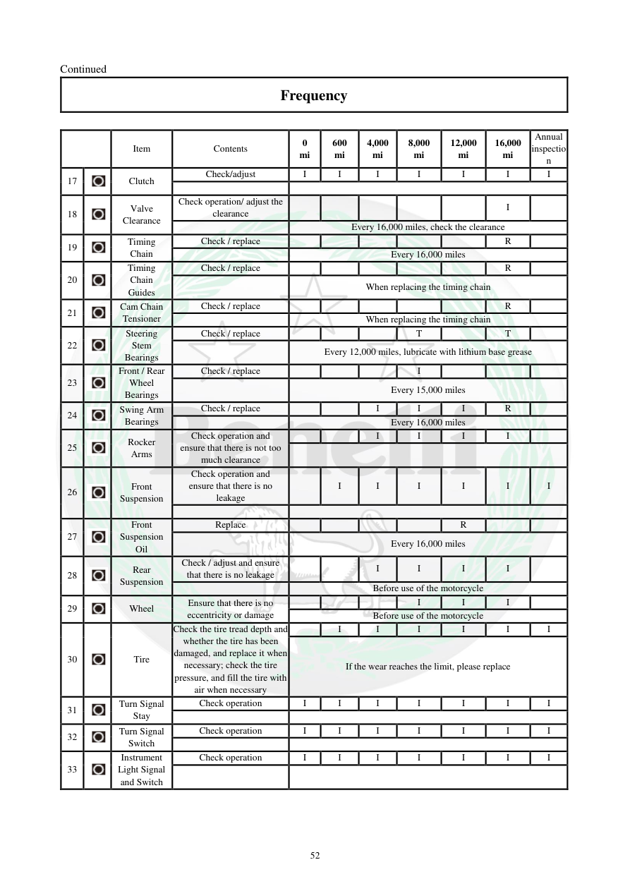

# Manual page 53

> Source: [page-0053.md](../source/page-0053.md)

## Page image / diagram

## Extracted text

# Source page 53

 
52 
Continued  
Frequency  
 
 
Item  
Contents  
0 
mi 
600 
mi 
4,000 
mi 
8,000 
mi 
12,000 
mi 
16,000 
mi 
Annual 
inspectio
n  
17 
 
Clutch  
Check/adjust  
I 
I 
I 
I 
I 
I 
I 
 
 
18 
 
Valve 
Clearance  
Check operation/ adjust the 
clearance  
 
 
 
 
 
I 
 
 
Every 16,000 miles, check the clearance  
19 
 
Timing 
Chain  
Check / replace 
 
 
 
 
 
R 
 
 
Every 16,000 miles 
20 
 
Timing 
Chain 
Guides  
Check / replace 
 
 
 
 
 
R 
 
 
When replacing the timing chain 
21 
 
Cam Chain 
Tensioner  
Check / replace 
 
 
 
 
 
R 
 
 
When replacing the timing chain 
22 
 
Steering 
Stem 
Bearings  
Check / replace 
 
 
 
T 
 
T 
 
 
Every 12,000 miles, lubricate with lithium base grease 
23 
 
Front / Rear 
Wheel 
Bearings  
Check / replace 
 
 
 
I 
 
 
 
 
Every 15,000 miles 
24 
 
Swing Arm 
Bearings   
Check / replace 
 
 
I 
I 
I 
R 
 
 
Every 16,000 miles 
25 
 
Rocker 
Arms  
Check operation and 
ensure that there is not too 
much clearance  
 
 
I 
I 
I 
I 
 
 
26 
 
Front 
Suspension  
Check operation and 
ensure that there is no 
leakage  
 
I 
I 
I 
I 
I 
I 
 
 
27 
 
Front 
Suspension 
Oil  
Replace 
 
 
 
 
R 
 
 
 
Every 16,000 miles 
28 
 
Rear 
Suspension 
Check / adjust and ensure 
that there is no leakage  
 
 
I 
I 
I 
I 
 
 
Before use of the motorcycle  
29 
 
Wheel  
Ensure that there is no 
eccentricity or damage  
 
 
 
I 
I 
I 
 
Before use of the motorcycle 
30 
 
Tire  
Check the tire tread depth and 
whether the tire has been 
damaged, and replace it when 
necessary; check the tire 
pressure, and fill the tire with 
air when necessary   
 
I 
I 
I 
I 
I 
I 
If the wear reaches the limit, please replace 
31 
 
Turn Signal 
Stay  
Check operation 
I 
I 
I 
I 
I 
I 
I 
 
 
32 
 
Turn Signal 
Switch 
Check operation 
I 
I 
I 
I 
I 
I 
I 
 
 
33 
 
Instrument 
Light Signal 
and Switch 
Check operation 
I 
I 
I 
I 
I 
I 
I

## Persian notes

<!-- Persian translation/explanation will be added here. -->
