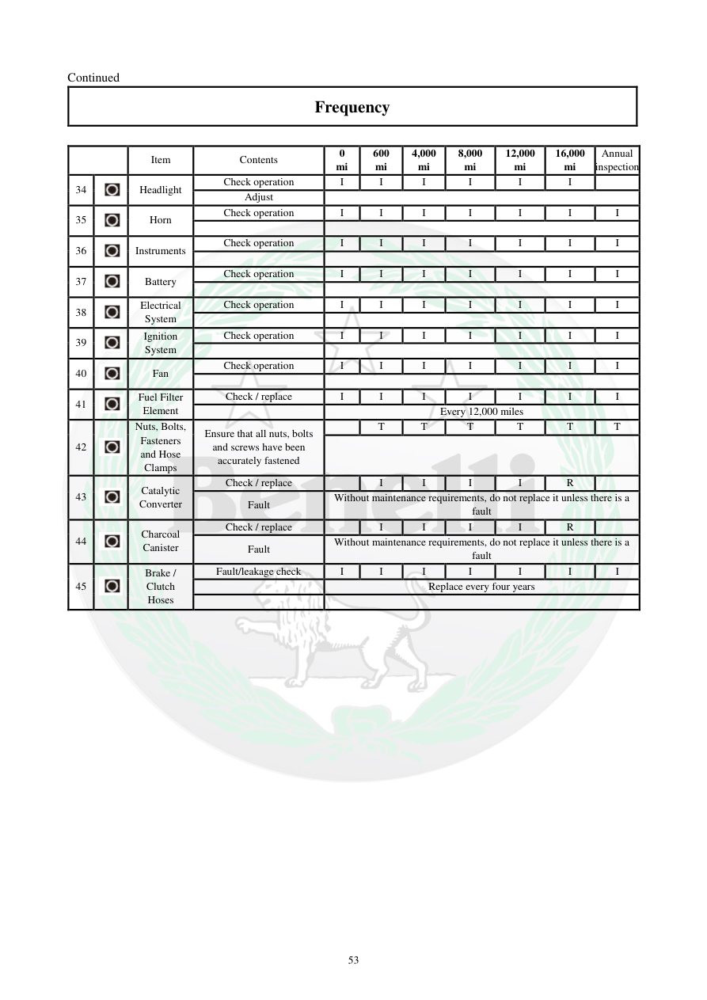

# Manual page 54

> Source: [page-0054.md](../source/page-0054.md)

## Page image / diagram

## Extracted text

# Source page 54

 
53 
Continued  
Frequency  
 
 
Item  
Contents  
0 
mi 
600 
mi 
4,000 
mi 
8,000 
mi 
12,000 
mi 
16,000 
mi 
Annual 
inspection
34 
 
Headlight 
Check operation 
I 
I 
I 
I 
I 
I 
 
Adjust  
 
35 
 
Horn 
Check operation 
I 
I 
I 
I 
I 
I 
I 
 
 
36 
 
Instruments  
Check operation 
I 
I 
I 
I 
I 
I 
I 
 
 
37 
 
Battery  
Check operation 
I 
I 
I 
I 
I 
I 
I 
 
 
38 
 
Electrical 
System  
Check operation 
I 
I 
I 
I 
I 
I 
I 
 
 
39 
 
Ignition 
System  
Check operation 
I 
I 
I 
I 
I 
I 
I 
 
 
40 
 
Fan  
Check operation 
I 
I 
I 
I 
I 
I 
I 
 
 
41 
 
Fuel Filter 
Element  
Check / replace 
I 
I 
I 
I 
I 
I 
I 
 
Every 12,000 miles 
42 
 
Nuts, Bolts, 
Fasteners 
and Hose 
Clamps  
Ensure that all nuts, bolts 
and screws have been 
accurately fastened  
 
T 
T 
T 
T 
T 
T 
 
43 
 
Catalytic 
Converter 
Check / replace 
 
I 
I 
I 
I 
R 
 
Fault  
Without maintenance requirements, do not replace it unless there is a 
fault 
44 
 
Charcoal 
Canister 
Check / replace 
 
I 
I 
I 
I 
R 
 
Fault 
Without maintenance requirements, do not replace it unless there is a 
fault  
45 
 
Brake / 
Clutch 
Hoses 
Fault/leakage check 
I 
I 
I 
I 
I 
I 
I 
 
Replace every four years

## Persian notes

<!-- Persian translation/explanation will be added here. -->
