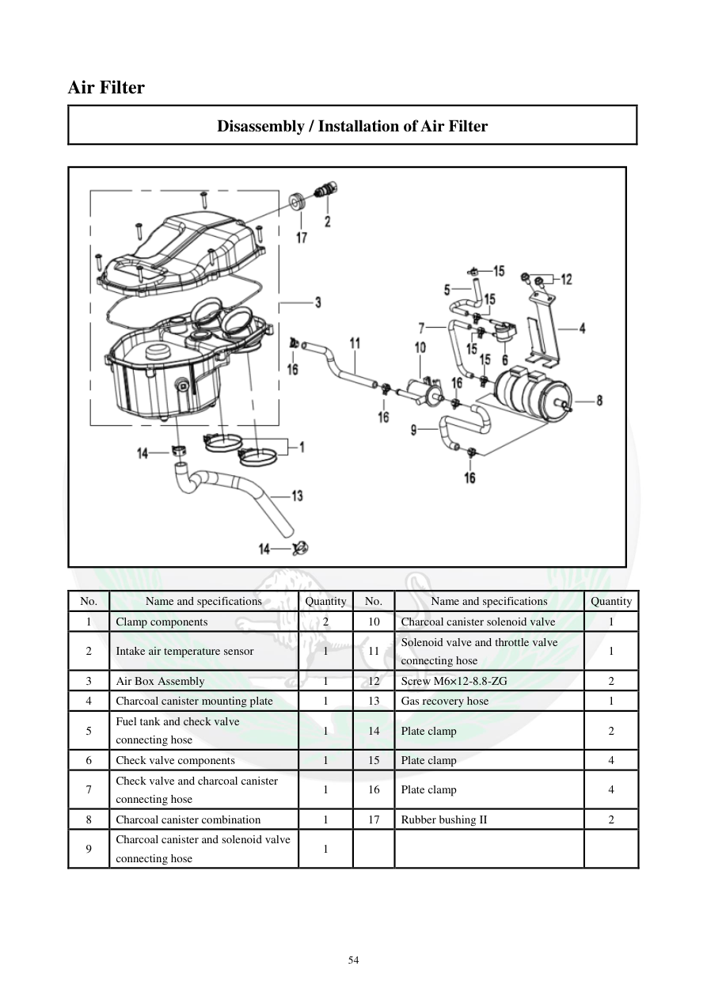

# Manual page 55

> Source: [page-0055.md](../source/page-0055.md)

## Page image / diagram

- [page-0055-img-02.png](../images/embedded/page-0055-img-02.png)

## Extracted text

# Source page 55

 
54 
Air Filter  
Disassembly / Installation of Air Filter  
 
 
 
No. 
Name and specifications  
Quantity 
No. 
Name and specifications  
Quantity 
1 
Clamp components 
2 
10 
Charcoal canister solenoid valve 
1 
2 
Intake air temperature sensor 
1 
11 
Solenoid valve and throttle valve 
connecting hose 
1 
3 
Air Box Assembly 
1 
12 
Screw M6×12-8.8-ZG 
2 
4 
Charcoal canister mounting plate  
1 
13 
Gas recovery hose  
1 
5 
Fuel tank and check valve 
connecting hose 
1 
14 
Plate clamp 
2 
6 
Check valve components  
1 
15 
Plate clamp 
4 
7 
Check valve and charcoal canister 
connecting hose  
1 
16 
Plate clamp 
4 
8 
Charcoal canister combination  
1 
17 
Rubber bushing II  
2 
9 
Charcoal canister and solenoid valve 
connecting hose  
1

## Persian notes

<!-- Persian translation/explanation will be added here. -->
