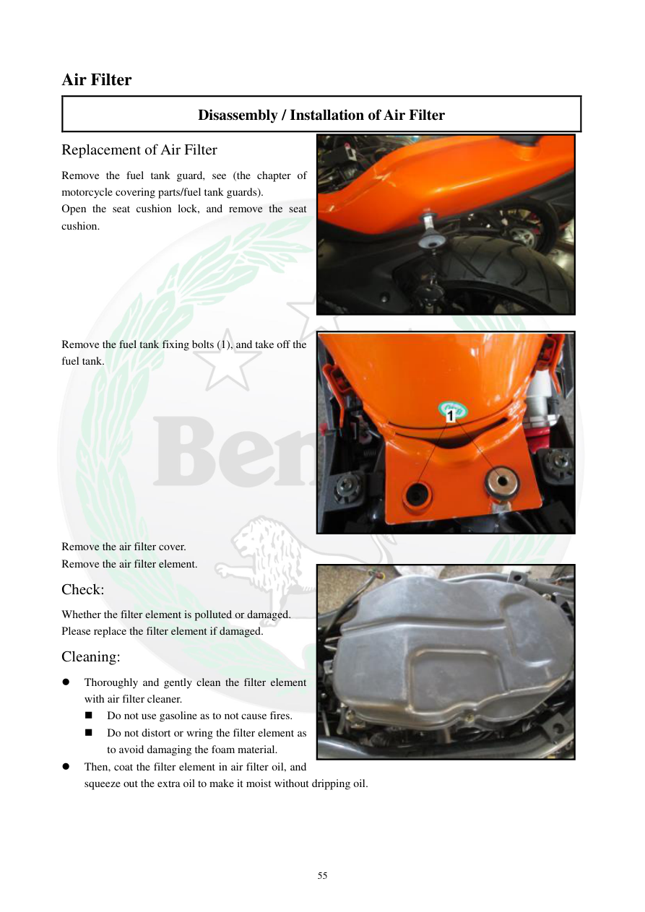

# Manual page 56

> Source: [page-0056.md](../source/page-0056.md)

## Page image / diagram

- [page-0056-img-02.jpeg](../images/embedded/page-0056-img-02.jpeg)

- [page-0056-img-03.jpeg](../images/embedded/page-0056-img-03.jpeg)

- [page-0056-img-04.jpeg](../images/embedded/page-0056-img-04.jpeg)

## Extracted text

# Source page 56

 
55 
Air Filter 
Disassembly / Installation of Air Filter 
Replacement of Air Filter  
Remove the fuel tank guard, see (the chapter of 
motorcycle covering parts/fuel tank guards). 
Open the seat cushion lock, and remove the seat 
cushion. 
 
 
 
 
 
 
Remove the fuel tank fixing bolts (1), and take off the 
fuel tank. 
 
 
 
 
 
 
 
 
 
 
Remove the air filter cover. 
Remove the air filter element. 
Check: 
Whether the filter element is polluted or damaged. 
Please replace the filter element if damaged. 
Cleaning: 
 
Thoroughly and gently clean the filter element 
with air filter cleaner. 
 
Do not use gasoline as to not cause fires. 
 
Do not distort or wring the filter element as 
to avoid damaging the foam material. 
 
Then, coat the filter element in air filter oil, and 
squeeze out the extra oil to make it moist without dripping oil.

## Persian notes

### ترجمه و کاربرد تعمیراتی

مراحل تعویض فیلتر هوا:
1. محافظ باک را باز کنید.
2. قفل زین را باز و زین را خارج کنید.
3. پیچ‌های نگهدارنده باک را باز و باک را خارج کنید.
4. درپوش Air Box را باز کنید.
5. المان فیلتر هوا را خارج کنید.
6. فیلتر را از نظر آلودگی یا آسیب بررسی کنید؛ در صورت آسیب تعویض شود.

تمیزکاری:
- با شوینده مخصوص فیلتر هوا، آرام و کامل تمیز شود.
- بنزین استفاده نشود، چون خطر آتش‌سوزی دارد.
- فیلتر فومی را نپیچانید و مچاله نکنید.
- پس از تمیزکاری، روغن مخصوص فیلتر هوا زده و روغن اضافی گرفته شود تا چکه نکند.

تصاویر همین صفحه برای ترتیب دسترسی به باک، Air Box و فیلتر مرجع عملی این بخش هستند.
