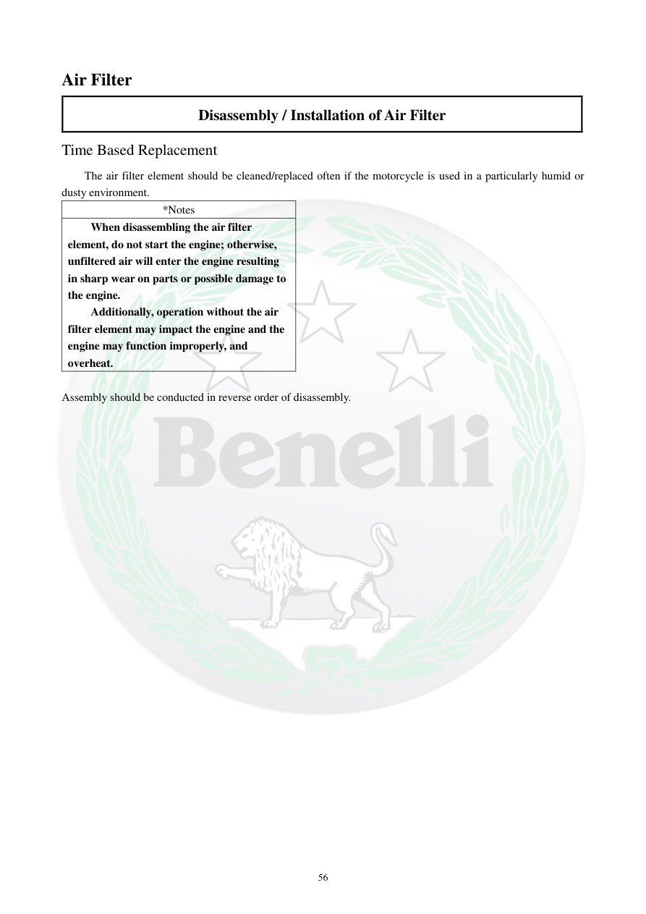

# Manual page 57

> Source: [page-0057.md](../source/page-0057.md)

## Page image / diagram

## Extracted text

# Source page 57

 
56 
Air Filter 
Disassembly / Installation of Air Filter 
Time Based Replacement 
The air filter element should be cleaned/replaced often if the motorcycle is used in a particularly humid or 
dusty environment.  
*Notes 
When disassembling the air filter 
element, do not start the engine; otherwise, 
unfiltered air will enter the engine resulting 
in sharp wear on parts or possible damage to 
the engine. 
Additionally, operation without the air 
filter element may impact the engine and the 
engine may function improperly, and 
overheat. 
 
Assembly should be conducted in reverse order of disassembly.

## Persian notes

<!-- Persian translation/explanation will be added here. -->
