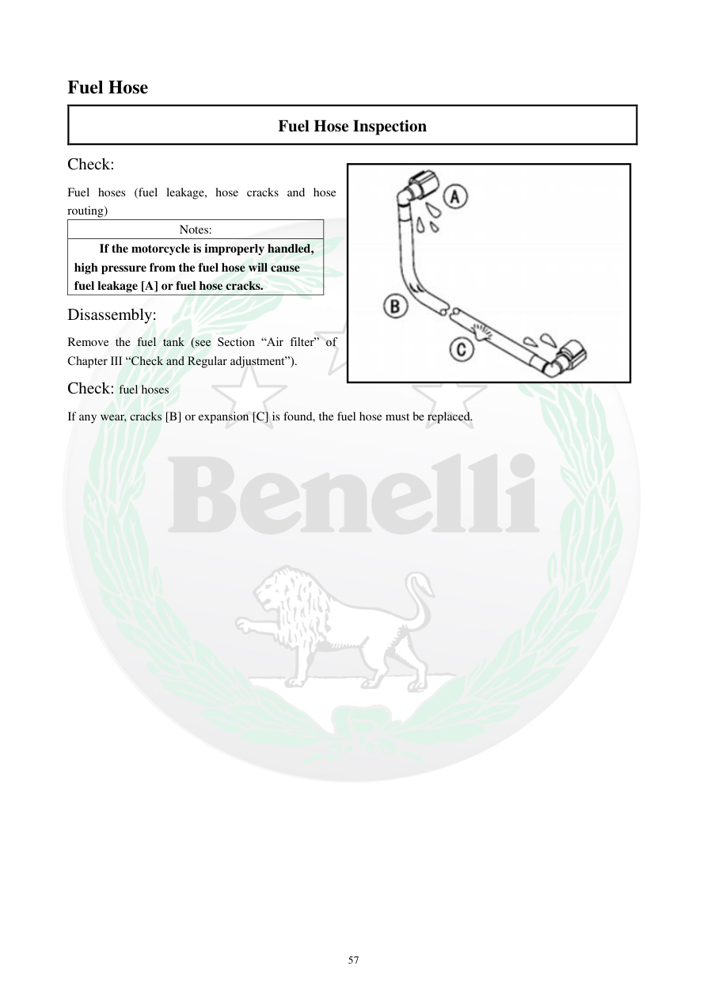

# Manual page 58

> Source: [page-0058.md](../source/page-0058.md)

## Page image / diagram

- [page-0058-img-02.jpeg](../images/embedded/page-0058-img-02.jpeg)

## Extracted text

# Source page 58

 
57 
Fuel Hose 
Fuel Hose Inspection 
Check: 
Fuel hoses (fuel leakage, hose cracks and hose 
routing) 
Notes: 
If the motorcycle is improperly handled, 
high pressure from the fuel hose will cause 
fuel leakage [A] or fuel hose cracks. 
Disassembly: 
Remove the fuel tank (see Section “Air filter” of 
Chapter III “Check and Regular adjustment”). 
Check: fuel hoses 
If any wear, cracks [B] or expansion [C] is found, the fuel hose must be replaced.

## Persian notes

### ترجمه و کاربرد تعمیراتی

این صفحه مربوط به **بازرسی شیلنگ‌های سوخت** است.

موارد بررسی:
- نشتی بنزین
- ترک‌خوردگی شیلنگ
- مسیر عبور و قرارگیری صحیح شیلنگ
- فرسودگی
- برآمدگی یا بادکردگی

دفترچه هشدار می‌دهد که فشار بالای مدار سوخت در صورت خرابی یا استفاده نادرست می‌تواند باعث **نشتی یا ترک شیلنگ** شود.

برای بازرسی، ابتدا باک طبق بخش Air Filter باز/خارج می‌شود. اگر هرگونه فرسودگی، ترک یا برآمدگی مشاهده شد، شیلنگ سوخت باید تعویض شود.

تصویر صفحه برای تشخیص محل و مسیر شیلنگ‌ها مرجع عملی این بخش است.
