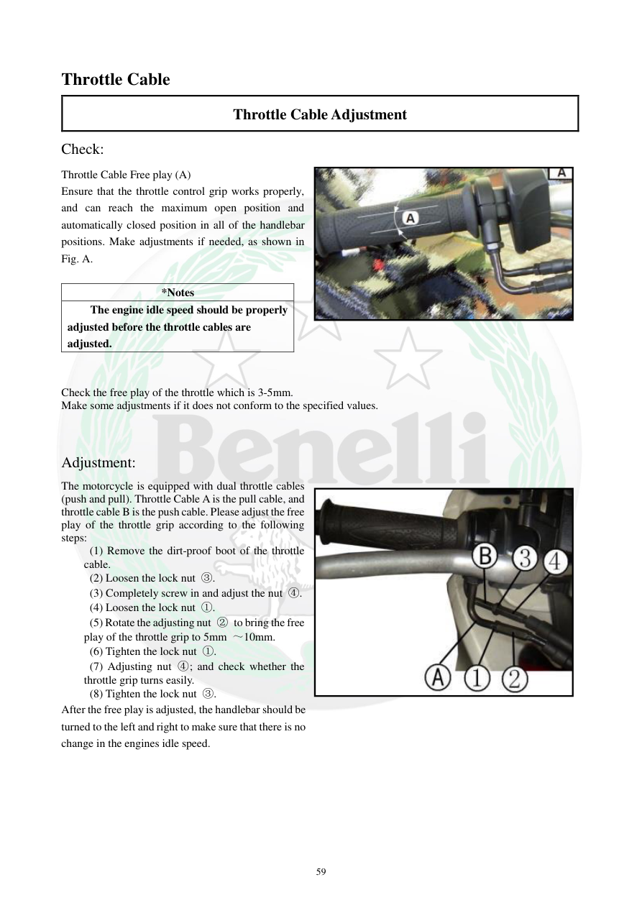

# Manual page 60

> Source: [page-0060.md](../source/page-0060.md)

## Page image / diagram

- [page-0060-img-02.jpeg](../images/embedded/page-0060-img-02.jpeg)

- [page-0060-img-03.jpeg](../images/embedded/page-0060-img-03.jpeg)

## Extracted text

# Source page 60

 
59 
Throttle Cable 
Throttle Cable Adjustment 
Check: 
Throttle Cable Free play (A) 
Ensure that the throttle control grip works properly, 
and can reach the maximum open position and 
automatically closed position in all of the handlebar 
positions. Make adjustments if needed, as shown in 
Fig. A. 
 
*Notes 
The engine idle speed should be properly 
adjusted before the throttle cables are 
adjusted. 
 
 
Check the free play of the throttle which is 3-5mm. 
Make some adjustments if it does not conform to the specified values. 
 
Adjustment: 
The motorcycle is equipped with dual throttle cables 
(push and pull). Throttle Cable A is the pull cable, and 
throttle cable B is the push cable. Please adjust the free 
play of the throttle grip according to the following 
steps: 
 (1) Remove the dirt-proof boot of the throttle 
cable. 
 (2) Loosen the lock nut ③. 
 (3) Completely screw in and adjust the nut ④. 
 (4) Loosen the lock nut ①. 
 (5) Rotate the adjusting nut ② to bring the free 
play of the throttle grip to 5mm ～10mm. 
 (6) Tighten the lock nut ①. 
 (7) Adjusting nut ④; and check whether the 
throttle grip turns easily. 
 (8) Tighten the lock nut ③. 
After the free play is adjusted, the handlebar should be 
turned to the left and right to make sure that there is no 
change in the engines idle speed.

## Persian notes

### ترجمه و کاربرد تعمیراتی

تنظیم لقی دسته گاز:
- دسته گاز باید در تمام وضعیت‌های فرمان روان باشد و به بازشدن کامل و بسته‌شدن خودکار برسد.
- متن دفترچه در ابتدا لقی را 3 تا 5 میلی‌متر اعلام می‌کند.
- قبل از تنظیم کابل گاز، دور آرام موتور باید درست تنظیم شده باشد.
- موتور دو کابل گاز دارد: کابل A کشنده و کابل B هل‌دهنده.

ترتیب تنظیم طبق متن:
1. روکش محافظ کابل را کنار بزنید.
2. مهره قفل ③ را شل کنید.
3. مهره تنظیم ④ را کاملاً داخل ببرید.
4. مهره قفل ① را شل کنید.
5. مهره تنظیم ② را برای تنظیم لقی بچرخانید.
6. مهره قفل ① را سفت کنید.
7. مهره ④ را تنظیم و روانی دسته گاز را بررسی کنید.
8. مهره قفل ③ را سفت کنید.
9. فرمان را به چپ و راست بچرخانید و مطمئن شوید دور آرام موتور تغییر نمی‌کند.

نکته: خود دفترچه در ادامه مرحله تنظیم مقدار 5 تا 10 میلی‌متر را نوشته است، در حالی که ابتدای بخش 3 تا 5 میلی‌متر آمده. این اختلاف باید حفظ شود و بدون تطبیق با تصویر/نسخه مدل، یکی از این دو عدد به‌عنوان مقدار قطعی انتخاب نشود.
